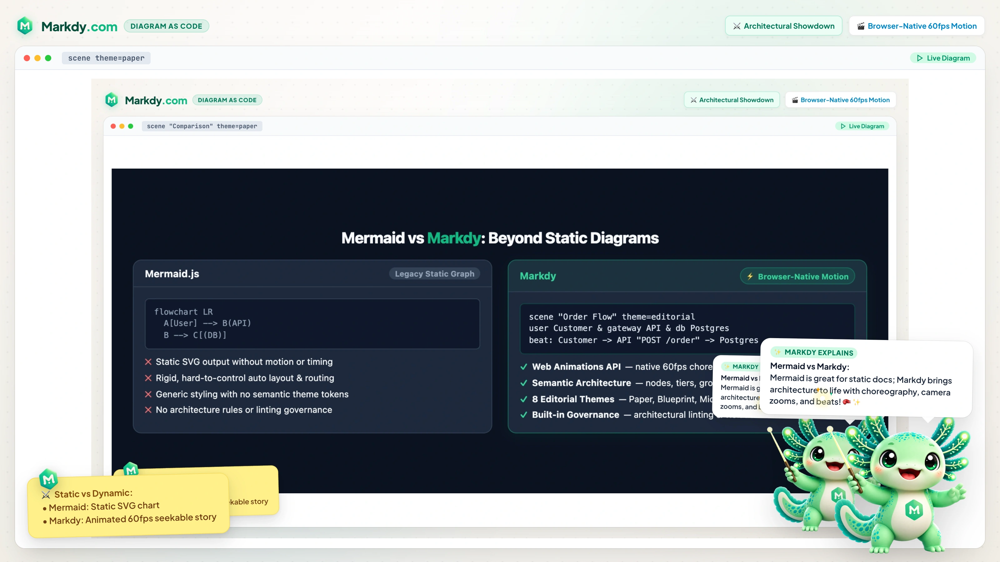

<p align="center">
  <a href="https://markdy.com">
    
  </a>
</p>

<p align="center">
  <strong>Diagram-as-code DSL for animated architecture &amp; system design explainers.</strong><br>
  Write declarative MarkdyScript → render 60fps browser-native kinetic diagrams with the Web Animations API.
</p>

<p align="center">
  <a href="https://markdy.com/playground/"><b>⚡ Launch Live Studio</b></a> &nbsp;•&nbsp;
  <a href="https://marketplace.visualstudio.com/items?itemName=hoangyell.markdy-vscode"><b>🔌 VS Code Extension</b></a> &nbsp;•&nbsp;
  <a href="https://markdy.com/docs/"><b>📖 Documentation</b></a> &nbsp;•&nbsp;
  <a href="https://markdy.com/examples/"><b>🌟 17+ Layout Examples</b></a> &nbsp;•&nbsp;
  <a href="https://markdy.com/agent/"><b>🤖 AI &amp; Agent Guide</b></a>
</p>

<p align="center">
  <a href="https://github.com/HoangYell/markdy-com/actions/workflows/ci.yml"></a>
  <a href="https://marketplace.visualstudio.com/items?itemName=hoangyell.markdy-vscode"></a>
  <a href="https://www.npmjs.com/package/@markdy/core"></a>
  <a href="https://www.npmjs.com/package/@markdy/core"></a>
  <a href="https://www.npmjs.com/package/@markdy/core"></a>
  <a href="https://stackblitz.com/github/HoangYell/markdy-com/tree/main/examples/astro-starter?file=src%2Fpages%2Findex.astro"></a>
  <a href="https://github.com/HoangYell/markdy-com/blob/main/LICENSE"></a>
</p>

<p align="center">
  <a href="https://markdy.com/playground/">
    
  </a>
  <br>
  <sub>⚡ <b><a href="https://markdy.com/playground/">Try the Interactive Studio &amp; Live Playground on markdy.com ↗</a></b></sub>
</p>

---

## Why Markdy?

Static diagrams don't tell the full story of complex distributed systems. **Markdy turns text into choreographed 60fps motion graphics** directly in your browser.

- 🎬 **Kinetic Storytelling**: Choreograph requests (`->`), responses (`<-`), and events (`~>`) across sequential `beat` timelines with camera zooms and glowing cues.
- 📐 **Zero-Config Routing**: Collision-aware orthogonal Manhattan edge routing and rank-based auto-layout — no manual `(x, y)` pixel coordinates.
- ⚡ **Zero-Dep & Web-Native**: Powered by pure CSS transforms and the Web Animations API (WAAPI). No Canvas, no heavy GSAP runtime, ~14 kB parser.
- 🔄 **Universal Ingestion**: Transpile existing Mermaid, Draw.io, Docker Compose, Kubernetes manifests, and Terraform states in 1 command (`markdy import`).
- 🤖 **AI-Native & MCP**: Official Model Context Protocol (MCP) server for Claude, Cursor, and Antigravity with self-healing syntax diagnostics.
- 🛡️ **Architecture Governance**: Built-in CI/CD rules prevent deadlock cycles, cross-layer bypasses, and generate visual AST diffs in pull requests.

---

## Mermaid vs Markdy

<p align="center">
  
</p>

| Capability | Mermaid.js / PlantUML | Markdy |
|---|---|---|
| **Animation & Timing** | ❌ Static SVG / PNG | ✅ 60fps browser-native WAAPI motion & seekable beats |
| **Return Flows & Cycles** | ⚠️ Rank distortion & tangled edges | ✅ Cycle-safe return paths (`<-`) & non-disruptive event arcs (`~>`) |
| **AI Agents & MCP** | ⚠️ Unvalidated text generation | ✅ Official MCP Server (`@markdy/mcp-server`) with self-healing AST |
| **Architecture Linter** | ❌ None | ✅ Built-in Well-Architected validation (`markdy lint --arch-rules`) |
| **Migration** | ❌ Manual rewrite | ✅ 1-click import from Mermaid, Draw.io, K8s, Compose, Terraform |

---

## Quick Start in 60 Seconds

### 1. Write MarkdyScript (`system.markdy`)

```markdy
scene "Cache-Aside Architecture" theme=paper
layout LR

browser Client "Web Client"
gateway Gateway "API Gateway"
service Shortener "URL Service"
cache Redis "Redis Cluster"
database Postgres "PostgreSQL 16"

group app "Application Tier": Gateway Shortener
group data "Persistence Tier": Redis Postgres

beat hit "1. Sub-2ms Cache Hit Path":
  show $nodes stagger=60ms
  frame Client Gateway Shortener Redis zoom=1.1
  Client -> Gateway "GET /x9" -> Shortener "resolve"
  Shortener -> Redis "GET slug:x9"
  Shortener <- Redis "200 Target URL"
  Client <- Gateway "301 Redirect"

beat miss "2. Cache Miss Fallback & Async Warm":
  frame Shortener Redis Postgres zoom=1.15
  Shortener -> Postgres "SELECT destination WHERE slug = 'x9'"
  Shortener <- Postgres "Row Found"
  Shortener ~> Redis "SETEX slug:url (Warm Cache)"
  glow Postgres color=#38bdf8 & glow Redis color=#22c55e
```

### 2. Run or Render via CLI

```sh
# Lint for syntax and architecture cycles
npx @markdy/cli lint system.markdy

# Render self-contained standalone HTML preview
npx @markdy/cli render system.markdy --out scene.html
```

### 3. Embed in Astro / React / MDX

```astro
---
import { Markdy } from "@markdy/astro";
---

<Markdy code={code} width={1000} height={500} autoplay client:visible />
```

---

## 🏛️ 17 Specialized Layout Engines & 8 Themes

Markdy supports 17 domain-specific layout topologies and 8 publication themes:

<p align="center">
  
</p>

| Category | Layout Engines | Ideal Use Cases |
|---|---|---|
| **Systems & Architecture** | `architecture`, `flowchart`, `tree`, `state`, `sequence` | Microservices, API gateways, OAuth PKCE flows, 2PC consensus |
| **Structure & Security** | `layers`, `nested`, `swimlane`, `quadrant`, `pyramid` | OSI 7-layer stack, Kubernetes enclaves, Saga workflows, CAP matrix |
| **Pipelines & Analytics** | `medallion`, `timeline`, `gantt`, `flywheel`, `constellation`, `radar`, `venn` | Bronze/Silver/Gold data pipelines, engineering roadmaps, raft quorum |

> 🎨 **Themes**: `paper` (default light), `editorial` (serif publication), `terminal` (dark CLI/TUI), `midnight` (modern dark), `blueprint` (CAD cyan), `sketchy` (hand-drawn), `nebula` (galaxy orbit), and `graphite` (minimalist).
>
> 🌟 **[Explore all 17+ interactive scenes in the Live Gallery ↗](https://markdy.com/examples/)**

---

## 🔄 Universal Ingestion (1-Command Import)

<p align="center">
  
</p>

Instantly convert existing static diagrams and infrastructure files into animated MarkdyScript scenes:

```sh
markdy import flow.mmd           --out flow.markdy        # Mermaid.js Flowcharts & Sequences
markdy import architecture.drawio --out diagram.markdy     # Draw.io / diagrams.net XML
markdy import docker-compose.yml --out compose.markdy     # Docker Compose Container Topologies
markdy import k8s-manifests/     --out cluster.markdy     # Kubernetes Ingress, Pods & Services
markdy import terraform.tfstate  --out infra.markdy       # Terraform State Resources
```

---

## 🤖 AI Agent & MCP Integration

Markdy is designed from the ground up for LLMs and autonomous coding agents:

<p align="center">
  
</p>

- **Canonical Specification**: Point AI assistants to [**`markdy.com/AGENT.md`**](https://markdy.com/agent/) or [**`markdy.com/llms-full.txt`**](https://markdy.com/llms-full.txt).
- **Official Model Context Protocol (MCP)**:
  ```json
  {
    "mcpServers": {
      "markdy": {
        "command": "npx",
        "args": ["-y", "@markdy/mcp-server"]
      }
    }
  }
  ```
  Equips assistants with `validate_markdy`, `heal_markdy`, `transpile_to_markdy`, `render_markdy_svg`, and `explain_architecture`.


---


## 📦 Packages & Ecosystem

All packages are published to **[npmjs.com](https://www.npmjs.com/org/markdy)** and **[GitHub Packages](https://github.com/HoangYell/markdy-com/packages)**:

| Package | Description | Size / Type |
|---|---|---|
| **[`@markdy/core`](packages/core)** | Pure TypeScript parser, AST diff, compiler, and architecture validator | ~14 kB (minzip) |
| **[`@markdy/renderer-dom`](packages/renderer-dom)** | 60fps Web Animations API renderer, GIF89a encoder, SVG exporter | ~24 kB (minzip) |
| **[`@markdy/mcp-server`](packages/mcp-server)** | Official Model Context Protocol (MCP) server for Claude, Cursor, Antigravity | Node CLI |
| **[`@markdy/cli`](packages/cli)** | Command-line tool for linting, rendering, diffing, and universal importing | Node CLI |
| **[`@markdy/compat`](packages/compat)** | Universal transpilers for Mermaid, Draw.io, Compose, K8s, Terraform | ~8 kB (minzip) |
| **[`@markdy/astro`](packages/astro)** | Astro island component with SSR placeholder and viewport hydration | ~2 kB (minzip) |
| **[`@markdy/mdx`](packages/mdx)** | Remark plugin + lazy React diagram component | ~4 kB (minzip) |
| **[`@markdy/language-server`](packages/markdy-language-server)** | Language Server Protocol (LSP) for VS Code, Cursor, and IDE extensions | Node LSP |
| **[`@markdy/stdlib-systems`](packages/stdlib-systems) | System diagram node vocabulary and visual primitive definitions | <1 kB |

---

## 📖 Documentation & Guides

| Guide | Description |
|---|---|
| **[Syntax Reference (SYNTAX.md)](docs/SYNTAX.md)** | Complete MarkdyScript DSL grammar, selectors, cues, and player settings |
| **[Interactive Tutorial (TUTORIAL.md)](docs/TUTORIAL.md)** | Step-by-step human guide from simple flows to complex multi-beat scenes |
| **[AI Agent Guide (AGENT.md)](docs/AGENT.md)** | LLM system prompts, canvas sizing formulas, and anti-patterns |
| **[Architecture Internals (ARCHITECTURE.md)](docs/ARCHITECTURE.md)** | Compiler pipeline, WAAPI rAF loop, collision-free routing geometry |
| **[GitHub Packages Guide (GITHUB_PACKAGES.md)](docs/GITHUB_PACKAGES.md)** | Installing packages from GitHub npm package registry |

---

## Development

```sh
git clone https://github.com/HoangYell/markdy-com.git
cd markdy-com
pnpm install
pnpm build
pnpm test
```

## Contributing

Contributions are welcome! Please check out [CONTRIBUTING.md](CONTRIBUTING.md) for local development setup, coding guidelines, and submitting pull requests.

---

<p align="center">
  <br>
  <strong>Loving Markdy? Star the repository on GitHub! ⭐</strong><br>
  <sub>Built with ❤️ by <a href="https://hoangyell.com">Hoang Yell</a> &amp; the open-source community.</sub>
</p>

## License

[MIT](LICENSE) © [Hoang Yell](https://hoangyell.com)