<p align="center">
  <a href="https://markdy.com">
    
  </a><br>
  <strong>Open-source DSL for animated architecture &amp; system diagrams.</strong><br>
  Write diagram-native MarkdyScript → get browser-native motion graphics that stay version-controlled, PR-friendly, and AI-native.
</p>

<p align="center">
  <a href="https://markdy.com/playground/"><b>⚡ Try the Interactive Studio / Playground</b></a>
</p>

<p align="center">
  <a href="https://github.com/HoangYell/markdy-com/actions/workflows/ci.yml"></a>
  <a href="https://www.npmjs.com/package/@markdy/core"></a>
  <a href="https://bundlephobia.com/package/@markdy/core"></a>
  <a href="https://stackblitz.com/github/HoangYell/markdy-com/tree/main/examples/astro-starter"></a>
  <a href="LICENSE"></a>
</p>

<p align="center">
  <a href="https://markdy.com/playground/">
    
  </a>
</p>

---

## What is Markdy?

**Markdy is a framework-agnostic, diagram-native DSL for animated architecture and system diagrams.** Declare semantic nodes, groups, beats, flows, and cues in MarkdyScript — Markdy handles layout, edge routing, timing, and browser-native rendering with the Web Animations API. No Canvas, no GSAP, zero bloated dependencies.

> Markdy is built for **animated architecture diagrams and system-design explainers**.
> The built-in vocabulary expresses architecture, cloud, Kubernetes, CI/CD, auth, data, messaging, state-machine, and flow diagrams.
>
> If you are searching for a **Mermaid alternative with animation**, **animated architecture diagrams**, **diagram as code**, **AI-generated diagrams**, **text-to-diagram**, **architecture as code**, or **docs-as-code motion graphics**, Markdy is designed for that workflow.

```markdy
scene theme=paper
layout LR

browser Client
service API
database DB

beat main "Trace the request":
  show $nodes
  frame Client API zoom=1.12
  Client -> API "GET /items" -> DB "query"
  Client <- API "200 OK"
```

### Key Features

| Feature | Detail |
|---|---|
| **Zero-dep parser & engines** | `@markdy/core` is pure TypeScript — AST parser, architecture linter, semantic classifier, AST diff engine, brand theme generator, and URL state codec |
| **Web-native renderer** | Web Animations API + CSS transforms. No Canvas, no GSAP, zero dependencies |
| **17 Specialized Layout Engines** | `architecture` (LR, RL, TB, BT), `flowchart`, `tree`, `state`, `sequence`, `constellation`, `loop`/`flywheel`, `medallion`, `quadrant`, `swimlane`, `pyramid`, `radar`, `timeline`, `gantt`, `venn`, `grid`, and `radial` |
| **8 Semantic Themes** | `paper`, `editorial`, `nebula`, `midnight`, `blueprint`, `graphite`, `terminal` (CLI/TUI dark mode), and `sketchy` (editorial hand-drawn) |
| **Universal Ingestion** | Instant transpilers for Mermaid, draw.io, Docker Compose, Kubernetes manifests, and Terraform state into animated MarkdyScript scenes (`markdy import`) |
| **Brand Theme Generator** | Extract and generate WCAG-compliant light and dark themes from any brand hex color (`generateThemeFromBrand()`) |
| **Output Size Presets** | 8 standard export presets (`doc-inline`, `doc-wide`, `slide-16x9`, `slide-4x3`, `social-og`, `social-square`, `print-a4`, `print-letter`) |
| **Architecture Governance** | Built-in Well-Architected validation: layer boundaries, deadlock cycle detection, gateway checks, and isolation rules (`markdy lint --arch-rules`) |
| **Semantic AST Diffing** | Compares architecture versions, outputs Markdown audit tables, and generates animated evolution scenes (`markdy diff`) |
| **Media Exporters** | Zero-dep GIF89a encoder with LZW compression for animated GitHub READMEs and vector SVG export for Figma |
| **Model Context Protocol (MCP)** | `@markdy/mcp-server` equips Claude, Cursor, Antigravity, and AI agents with validation, transpilation, and architecture explanation tools |
| **Diagram-native DSL** | Declare nodes, `group`s, and `beat`s; the engine handles layout, routing, timing, and rendering |
| **Auto-layout + routing** | Rank-based layout and collision-aware orthogonal Manhattan edge routing are built in — no coordinates required |
| **Flow operators** | `->` request, `<-` response, `~>` event, `--` dependency, each with its own edge style |
| **Beats + cues** | Sequence reveals with `beat` blocks, captions, and `show`/`hide`/`glow`/`focus`/`frame` cues; run cues together with `&` |
| **Semantic node cards** | Kind-aware SVG glyphs for browsers, services, gateways, queues, workers, databases, storage, CDN, security, hub, station, medals, and more |
| **Editorial Callouts** | Italic-serif annotations with dashed Bézier leaders, landing dots, and color intents (`accent`, `muted`, `neutral`) |
| **Astro & MDX Ready** | `<Markdy />` islands that hydrate on viewport entry with zero layout shift |
| **AI-agent friendly** | Structured DSL that LLMs can generate, validate, and iterate on ([Agent Guide](https://markdy.com/agent/)) |

---

## Packages

| Package | Description | Size |
|---|---|---|
| [`@markdy/core`](packages/core) | Parser + AST diff, architecture linter, semantic classifier, URL codec (zero runtime deps) | ~14 KB |
| [`@markdy/compat`](packages/compat) | Universal transpilers (Mermaid, Docker Compose, Kubernetes, Terraform) & snapshot gates | ~8 KB |
| [`@markdy/renderer-dom`](packages/renderer-dom) | Web Animations API renderer, GIF89a encoder, SVG exporter, presentation controller | ~24 KB |
| [`@markdy/cli`](packages/cli) | CLI for linting, architecture rules, formatting, importing, diffing, explaining, and sharing | Node package |
| [`@markdy/mcp-server`](packages/mcp-server) | Official Model Context Protocol (MCP) server for AI coding assistants & agents | Node package |
| [`@markdy/language-server`](packages/markdy-language-server) | Shared LSP server for editors and IDE integrations | Node package |
| [`@markdy/astro`](packages/astro) | Astro island component | ~2 KB |
| [`@markdy/mdx`](packages/mdx) | MDX remark plugin + lazy React diagram component | ~4 KB |
| [`@markdy/stdlib-systems`](packages/stdlib-systems) | Architecture nodes, visual primitives, and request/response/emit flows for animated diagrams | <1 KB |

---

## Search intent: when to use Markdy

Developers usually discover this problem through many names:

- "Mermaid but animated"
- "Markdown animation"
- "animated diagrams as code"
- "text-to-diagram with motion"
- "AI-generated architecture diagrams"
- "sequence diagrams for developer docs"
- "architecture visualization for docs"
- "docs-as-code animation"
- "LLM-friendly visual DSL"

Use Markdy when you want a diagram or explainer that is:

- **Text-first** — reviewable in pull requests and easy for AI agents to edit.
- **Time-based** — requests, responses, events, phased reveals, and emphasis happen in sequence.
- **Browser-native** — rendered with DOM/CSS/Web Animations instead of screenshots or video exports.
- **Documentation-friendly** — works in Astro, MDX, static sites, and package READMEs.

Use Mermaid, PlantUML, D2, Graphviz, Excalidraw, or draw.io when you need static diagrams. Use Markdy when the story depends on motion.

---

## CLI install note

`@markdy/cli` provides the `markdy` binary, but a normal project install does not put that binary on your shell PATH.

Use one of these depending on where you installed it:

```sh
npx markdy render examples/showcase/url-shortener-architecture.markdy --out examples/xscene.html
npm exec markdy render examples/showcase/url-shortener-architecture.markdy --out examples/xscene.html
npm i -g @markdy/cli
```

`--out` writes the generated HTML to the path you pass in, relative to the current working directory unless you give an absolute path.

## Ecosystem map (text)

```text
@markdy/core
  -> parses MarkdyScript into AST

@markdy/renderer-dom
  -> renders AST in the browser with Web Animations API

@markdy/astro, @markdy/mdx
  -> host integrations for site/content workflows

@markdy/cli
  -> lint, format, render, explain, and preview commands

@markdy/language-server
  -> diagnostics, completion, and hover in editors

@markdy/stdlib-systems
  -> optional node vocabulary manifest for architecture and technical diagrams
```

## Output preview

<p align="center">
  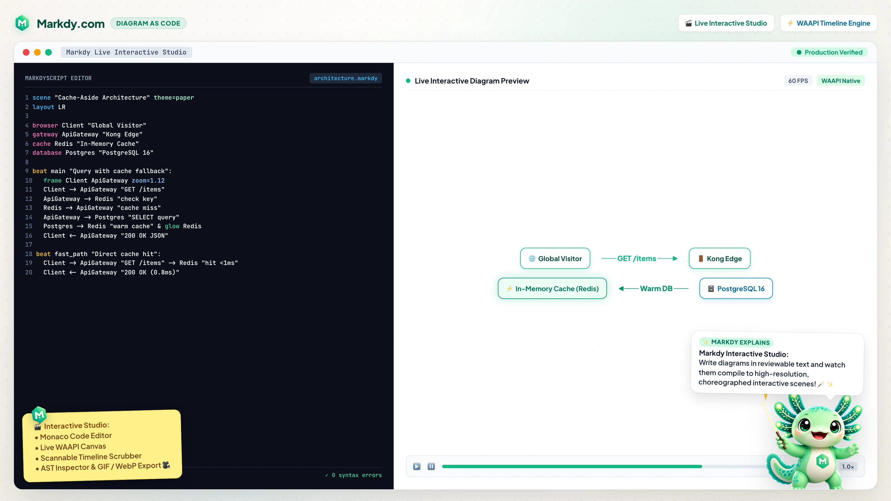
</p>

The dedicated playground mirrors this workflow: choose a shipped `.markdy` scene, edit syntax-highlighted MarkdyScript, resize the editor/preview split, and watch the embedded architecture preview update in the browser.

<p align="center">
  
</p>

---

## 🏛️ 17 Specialized Diagram Layout Engines

Explore the [Live Examples Gallery](https://markdy.com/examples/) or click any preview below to open it in the [Markdy Studio](https://markdy.com/playground/):

| ⚡ Systems & High Concurrency | 🚦 Decision Logic & Consensus |
|:---:|:---:|
| **Architecture (Cache-Aside Pattern)**<br><sub>Sub-2ms Redis cache redirection & database fallback</sub><br><br><a href="https://markdy.com/playground/"></a> | **Concurrency Strategy Flowchart**<br><sub>Thread safety, CAS atomics & mutex contention</sub><br><br><a href="https://markdy.com/playground/">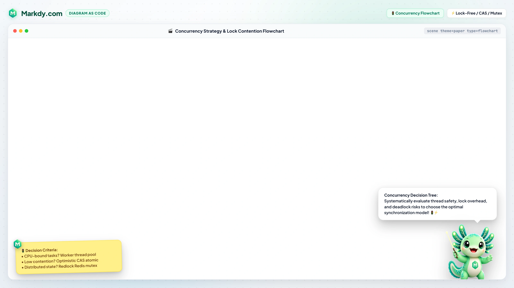</a> |
| **Consistent Hash Ring Tree**<br><sub>$O(k/N)$ minimal data rebalancing & vNode partitions</sub><br><br><a href="https://markdy.com/playground/"></a> | **OAuth 2.0 PKCE Auth Sequence**<br><sub>Zero-trust Single Page App authentication exchange</sub><br><br><a href="https://markdy.com/playground/"></a> |
| **Distributed 2PC Consensus State**<br><sub>Prepare/Commit/Abort multi-partition consensus</sub><br><br><a href="https://markdy.com/playground/">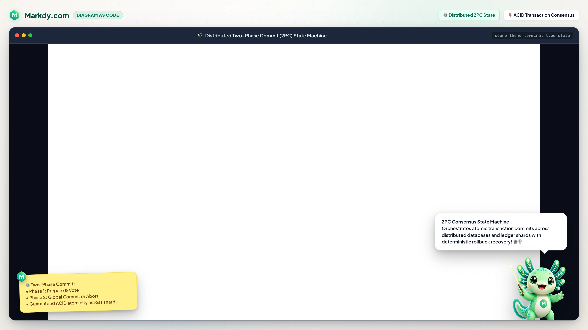</a> | **OSI 7-Layer Protocol Stack**<br><sub>Full-width horizontal packet encapsulation bands</sub><br><br><a href="https://markdy.com/playground/">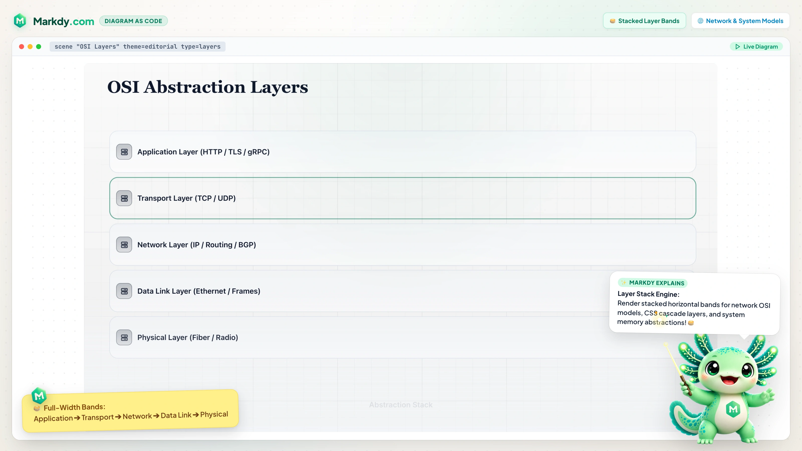</a> |
| **Zero-Trust Security Perimeter**<br><sub>Concentric defense-in-depth Kubernetes security enclaves</sub><br><br><a href="https://markdy.com/playground/">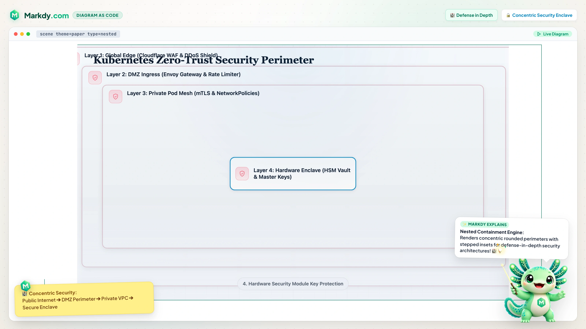</a> | **Distributed Saga Order Swimlanes**<br><sub>Cross-functional lanes & asynchronous rollback coordination</sub><br><br><a href="https://markdy.com/playground/"></a> |
| **Database WAL & CDC Stream Timeline**<br><sub>Zero-collision alternating milestone baseline</sub><br><br><a href="https://markdy.com/playground/">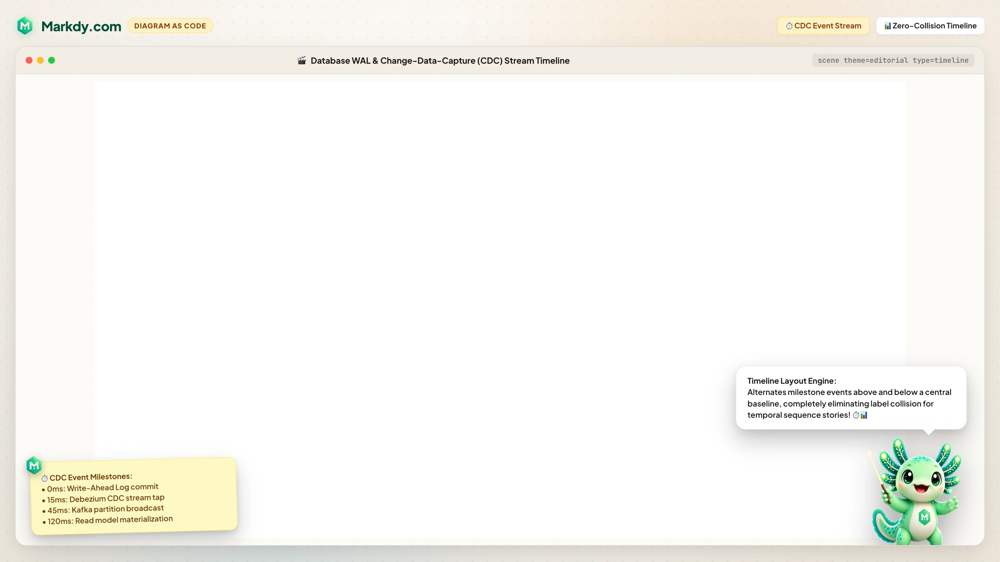</a> | **Zero-Downtime Migration Gantt**<br><sub>Multi-phase task spans & critical path dependencies</sub><br><br><a href="https://markdy.com/playground/">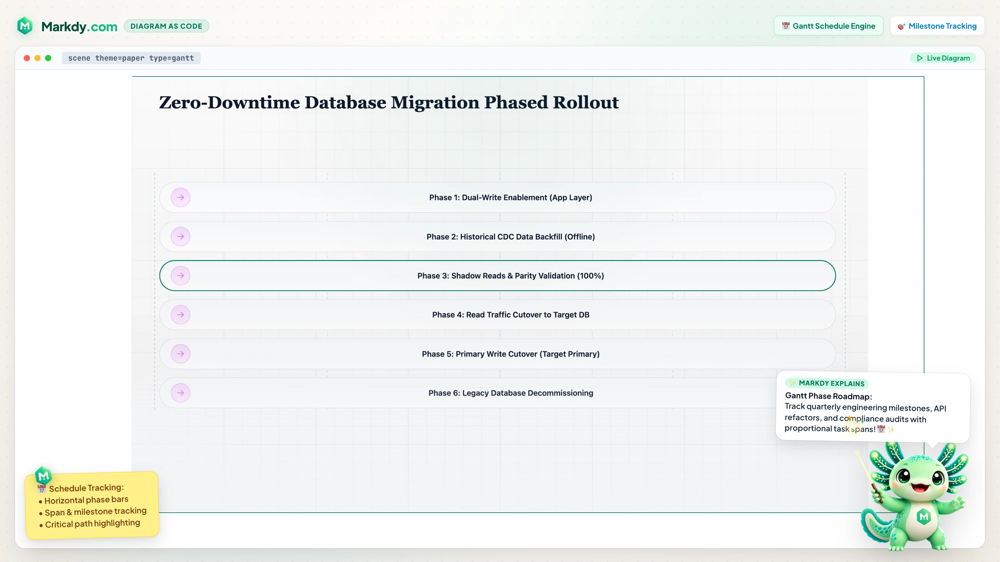</a> |
| **Lakehouse Medallion Data Pipeline**<br><sub>Streaming Bronze ➔ Silver ➔ Gold transformations</sub><br><br><a href="https://markdy.com/playground/"></a> | **Decentralized Gossip Flywheel**<br><sub>Circular closed-loop anti-entropy sync engine</sub><br><br><a href="https://markdy.com/playground/">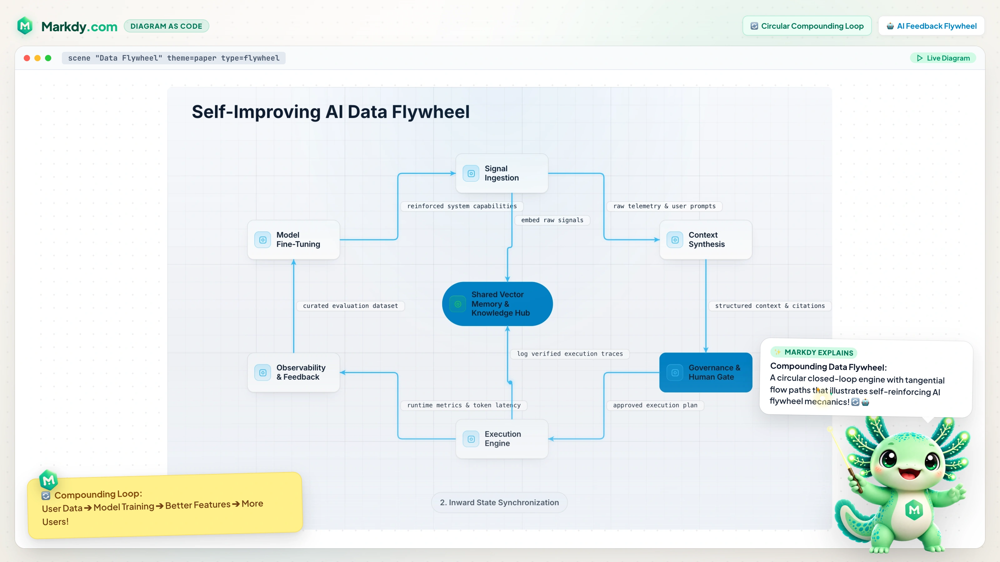</a> |
| **Raft Quorum Constellation (Nebula)**<br><sub>Radial orbit geometry & pulsating consensus halos</sub><br><br><a href="https://markdy.com/playground/"></a> | **CAP Theorem Decision Quadrant**<br><sub>Automated $2 \times 2$ matrix trade-off positioning</sub><br><br><a href="https://markdy.com/playground/">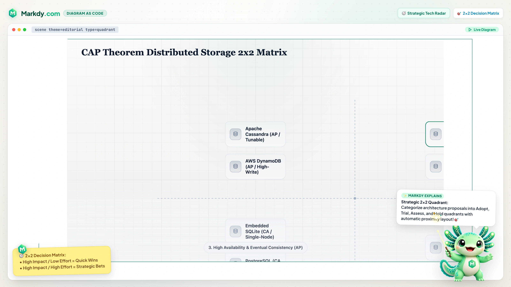</a> |
| **Cloud Observability Pyramid**<br><sub>Step-proportional telemetry & monitoring tier stack</sub><br><br><a href="https://markdy.com/playground/">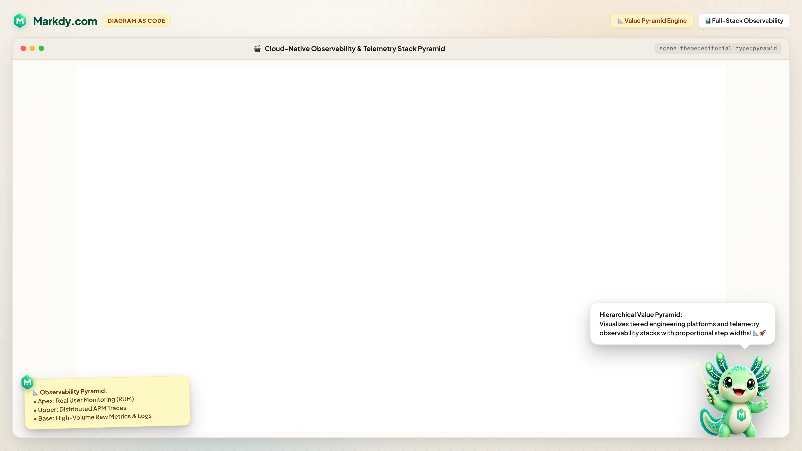</a> | **Storage Benchmark Radar**<br><sub>Multi-axis polygon database performance evaluation</sub><br><br><a href="https://markdy.com/playground/">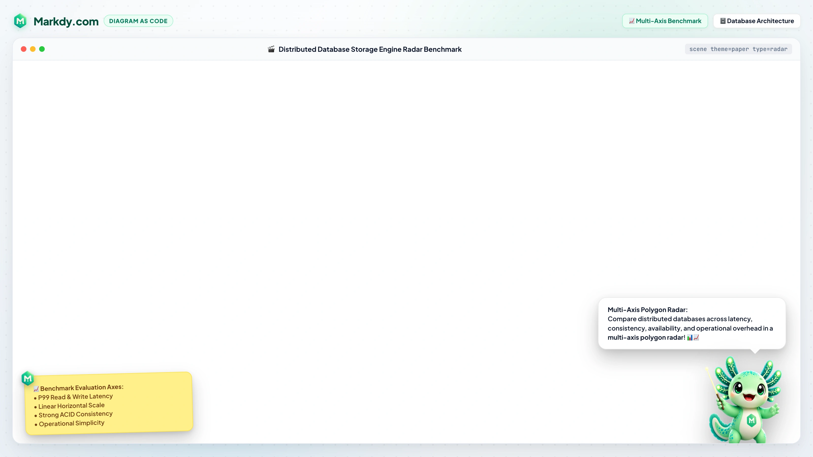</a> |
| **ACID vs BASE Consistency Venn**<br><sub>3-Circle concept intersection & sweet spot overlap</sub><br><br><a href="https://markdy.com/playground/">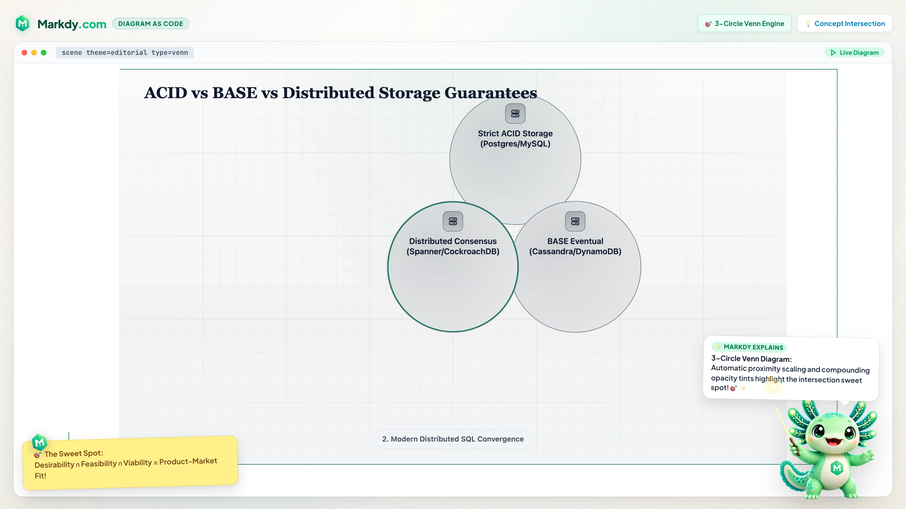</a> | **AI Agent Workflow & Prompting**<br><sub>Autonomous MCP tool execution & self-healing diagrams</sub><br><br><a href="https://markdy.com/agent/"></a> |

To preview a full scene result locally, run:

```sh
npx markdy render examples/showcase/url-shortener-architecture.markdy --out scene.html
```

## Quick Start

### Write a `.markdy` scene

Create `architecture.markdy`:

```markdy
scene theme=paper
layout LR

browser WebApp
service CheckoutApi
database OrdersDb

beat main:
  show $nodes stagger=80ms
  WebApp -> CheckoutApi "GET /orders" -> OrdersDb "query"
  WebApp <- CheckoutApi "200 OK"
```

Preview or validate it with the CLI:

```sh
pnpm add -D @markdy/cli
pnpm markdy lint architecture.markdy
pnpm markdy render architecture.markdy --out architecture.html
```

### Astro / MDX

```sh
pnpm add @markdy/astro
```

```astro
---
import { Markdy } from "@markdy/astro";

const code = `
  scene theme=paper width=800 height=400
  browser WebApp
  service CheckoutApi
  beat main:
    show $nodes
    WebApp -> CheckoutApi "GET /users"
`;
---

<Markdy code={code} width={800} height={400} bg="#07111f" autoplay />
```

### Parser Only (Node.js / Edge)

```ts
import { parse, ParseError } from "@markdy/core";

try {
  const ast = parse(source);
  console.log(ast.nodes);  // { API: { kind: "service", ... } }
  console.log(ast.beats);  // [{ name: "main", cues: [...] }]
} catch (e) {
  if (e instanceof ParseError) {
    console.error(`Line ${e.line}: ${e.message}`);
  }
}
```

---

## DSL at a Glance

Full reference: **[docs/SYNTAX.md](docs/SYNTAX.md)** · Step-by-step tutorial: **[docs/TUTORIAL.md](docs/TUTORIAL.md)** · Getting started: **[docs/GETTING_STARTED.md](docs/GETTING_STARTED.md)** · Guides: **[docs/GUIDES.md](docs/GUIDES.md)** · Comparisons: **[docs/COMPARISONS.md](docs/COMPARISONS.md)** · Troubleshooting: **[docs/TROUBLESHOOTING.md](docs/TROUBLESHOOTING.md)** · AI agent guide: **[markdy.com/agent](https://markdy.com/agent/)**

### Nodes + Beats + Flows

```markdy
scene theme=paper
layout LR

browser WebApp
service OrderService
database OrdersDb

beat main:
  show $nodes stagger=80ms
  WebApp -> OrderService "POST /order" -> OrdersDb "persist"
  WebApp <- OrderService "201 Created"
```

### Groups + Patterns

```markdy
group storage: Redis OrdersDb

pattern lookup(client, store):
  $client -> $store "lookup"
  $client <- $store "result"

beat read:
  use lookup(OrderService, Redis)
```

### Flow operators

| Operator | Edge kind | Rendered as |
|---|---|---|
| `->` | request | solid arrow |
| `<-` | response | dashed arrow, drawn back to the caller |
| `~>` | event | dotted arrow |
| `--` | dependency | thin link |

### Cues

Cues live inside a `beat` and are scheduled in order; put `&` between two cues to run them together.

| Cue | Description | Key parameters |
|---|---|---|
| `show` | Reveal nodes or groups | `stagger`, `dur` |
| `hide` | Fade nodes out | `dur` |
| `glow` | Emphasize with a colored glow | `color`, `strength`, `dur` |
| `focus` | Pulse-scale to draw attention | `zoom`, `dur` |
| `frame` | Move the scene camera to nodes or groups | `zoom`, `dur` |
| `use` | Expand a `pattern` | pattern args |

Selectors: `$nodes` targets every node, `$edges` targets structural and animated edges, and a group name targets its members.

### Player Configuration

Everything outside the scene itself can live in one optional `player:` block. Keep it at the bottom so the diagram remains the first thing readers see:

```markdy
scene theme=paper
layout LR

browser Client
service API

beat request:
  show $nodes
  Client -> API "GET /orders"

player:
  playback:
    loop false
  controls:
    speed true
    speeds "0.5 1"
    fit true
    share true
  interaction:
    zoom true
    pan true
  chrome:
    badge true
    progress boundary
```

| Group | Owns |
|---|---|
| `playback` | when and how fast the timeline runs |
| `controls` | which toolbar affordances are mounted |
| `interaction` | what pointer and key input do |
| `chrome` | non-interactive decoration (badge, progress) |

Controls are explicit opt-ins: only leaves set to `true` are mounted. `fit` frames every item and pins the camera so `frame`/`focus` zoom cues stop moving the view; `prev_beat`/`next_beat` step through beats. `rate` sets the initial multiplier, while `speeds` provides viewer choices; the speed selector needs at least two distinct positive values. The linked badge stays at the footer's right edge. `keyboard` is opt-in (<kbd>←</kbd>/<kbd>→</kbd> beats, <kbd>Space</kbd> play, <kbd>Home</kbd> restart) because it captures window key events. Legacy directives and flat keys normalize into the same groups; explicit host options gate or supply defaults for script settings.

### Themes & Layout Modes

**Themes (`theme=`):**
- `paper` — clean light documentation canvas (default)
- `editorial` — flat editorial paper with serif headings and semantic ink/accent roles
- `terminal` — dark CLI/TUI canvas with monospace font and neon glow accents
- `sketchy` — organic hand-drawn whiteboard theme with displacement filter
- `nebula` — deep-space canvas with orbit rings, signal halos, and starfield
- `midnight` — modern dark developer canvas
- `blueprint` — technical cyan-grid CAD canvas
- `graphite` — restrained dark minimal canvas

<p align="center">
  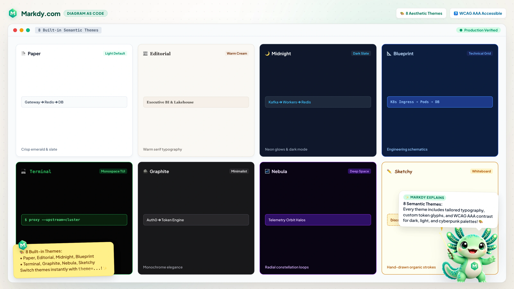
</p>

**Layout Types (`type=`):**
- `architecture` — ranked multi-tier systems and platform topology (default)
- `flowchart` — top-down steps, decisions, and merges
- `tree` — parent/child hierarchies with shared sibling buses
- `state` — cycle-safe state transitions and self-loops
- `sequence` — participant columns, lifelines, ordered messages, and activations
- `timeline` — horizontal hairline baseline with collision-free alternating milestone cards
- `gantt` — phase-based horizontal bar stacking with temporal span tracking
- `venn` — 2–3 circle concept intersection with proximity scaling
- `radar` — multi-axis polygon comparison chart with series color palette
- `medallion` — multi-tier Bronze → Silver → Gold data lakehouse stages
- `flywheel` / `loop` — circular closed-loop engine with tangential flow paths
- `quadrant` — 2×2 decision and strategic positioning matrix
- `swimlane` — multi-tier cross-functional horizontal lane partitions
- `pyramid` — hierarchical tier pyramid with step-proportional width scaling
- `constellation` — radial focal node with orbital signal rings

---

## API Reference

### `parse(source: string, opts?: ParseOptions): DiagramAST`

Parses MarkdyScript source into a typed diagram AST. Throws `ParseError` with line numbers on structural errors. Pure function with no side effects — runs in Node.js, Deno, edge runtimes, or the browser.

```ts
interface ParseOptions {
  parseOnly?: boolean;  // Skip layout/schedule compilation; parse structure only.
}
```

`DiagramAST` exposes `ast.meta`, `ast.nodes`, `ast.edges`, `ast.groups`, `ast.patterns`, `ast.beats`, and `ast.diagnostics[]` (soft warnings such as unknown scene properties). Call `compile(ast)` to produce a `RenderPlan` with positioned nodes, routed edges, and scheduled cues. See [docs/AGENT.md](docs/AGENT.md) for the full shape.

### `createDiagram(options: DiagramOptions): Diagram`

Creates a DOM-based animated diagram.

```ts
interface DiagramOptions {
  container: HTMLElement;    // Mount point
  code: string;             // MarkdyScript source
  autoplay?: boolean;       // Start immediately (default: true)
  loop?: boolean;           // Loop at end (default: true)
  copyright?: boolean;      // "Powered by Markdy" badge (default: true)
  progressBar?: boolean;    // Deprecated: use sceneBoundaryProgress
  sceneBoundaryProgress?: boolean; // Rainbow border progress bar (default: true)
  playbackRate?: number;    // Timeline speed multiplier (default: 1)
  interactiveViewport?: boolean; // true: default gestures; false: suppress script gestures
  controls?: boolean;       // true: legacy defaults; false: suppress script controls
  shareUrl?: string;        // Base URL for Share links
  onWarning?: (w: Diagnostic) => void;                 // Soft parse warnings
  onTimeUpdate?: (seconds: number, duration: number) => void;
  onPlayStateChange?: (playing: boolean) => void;
}

interface Diagram {
  play(): void;             // Start / resume
  pause(): void;            // Pause at current position
  seek(seconds: number): void;  // Jump to time
  setPlaybackRate(rate: number): void; // Set timeline speed, e.g. 0.5 or 2
  playbackRate(): number;    // Current timeline speed multiplier
  beats(): BeatRange[];         // Beat ranges in the compiled scene
  seekToBeat(name: string): void;  // Jump to a named beat
  nextBeat(): void;         // Step to the next beat from the current time
  prevBeat(): void;         // Step to the previous beat from the current time
  destroy(): void;          // Remove DOM + cancel animations
}
```

### `<Markdy />` (Astro Component)

| Prop | Type | Default | Description |
|---|---|---|---|
| `code` | `string` | *(required)* | MarkdyScript source |
| `width` | `number` | `800` | Placeholder width (px) |
| `height` | `number` | `400` | Placeholder height (px) |
| `bg` | `string` | `"white"` | Placeholder background colour |
| `assets` | `Record<string, string>` | `{}` | Asset URL overrides |
| `autoplay` | `boolean` | `true` | Auto-play when fully visible in viewport |
| `loop` | `boolean` | `true` | Loop the animation when it ends |
| `copyright` | `boolean` | script or `true` | Show the linked badge at the footer's right edge |
| `progressBar` | `boolean` | `true` | Show a rainbow progress bar around the viewport border |
| `sceneBoundaryProgress` | `boolean` | `progressBar` | Preferred flag for the rainbow scene-boundary progress bar |
| `playbackRate` | `number` | script or `1` | Initial timeline speed multiplier |
| `interactiveViewport` | `boolean` | script | `true` supplies default gestures; `false` suppresses script gestures |
| `controls` | `boolean` | script | `true` supplies legacy defaults; `false` suppresses script controls |
| `class` | `string` | — | CSS class for outer wrapper |

---

## Architecture

See **[docs/ARCHITECTURE.md](docs/ARCHITECTURE.md)** for technical details.

```
  MarkdyScript source
        │
        ▼
  ┌─────────────┐
  │ @markdy/core │  parse() → DiagramAST
  │  (parser)    │  Pure TS, zero deps
  └──────┬──────┘
         │ DiagramAST
         ▼
  ┌──────────────────┐
  │ @markdy/renderer  │  createDiagram() → Diagram
  │  -dom             │  WAAPI + rAF loop
  └──────┬───────────┘
         │ Diagram
         ▼
  ┌──────────────────┐
  │ @markdy/astro     │  <Markdy /> island
  │  (optional)       │  SSR placeholder + IntersectionObserver
  └──────────────────┘
```

All WAAPI animations are permanently paused. A `requestAnimationFrame` loop manually sets `anim.currentTime = sceneMs` each frame. This avoids browser-specific quirks with `startTime`-based resumption and enables reliable `seek()`.

---

## Development

```sh
git clone https://github.com/HoangYell/markdy-com.git
cd markdy-com
pnpm install
pnpm build
pnpm test
```

### Project Structure

```
packages/
  core/              @markdy/core         — Parser + AST types (zero deps)
  renderer-dom/      @markdy/renderer-dom — WAAPI renderer
  cli/               @markdy/cli          — CLI for local authoring workflows
  astro/             @markdy/astro        — Astro island component
  mdx/               @markdy/mdx          — MDX plugin + React diagram component with viewport hydration
  stdlib-systems/    @markdy/stdlib-systems — System-diagram node vocabulary
  markdy-language-server/ @markdy/language-server — Shared LSP server for editors
website/               Official markdy.com playground & website (Astro)
docs/
  SYNTAX.md          Full DSL reference
  TUTORIAL.md        Step-by-step human tutorial
  AGENT.md           Guide for AI agents / LLMs
  ARCHITECTURE.md    Technical deep dive
```

### Scripts

| Command | Description |
|---|---|
| `pnpm build` | Build all packages and website |
| `pnpm test` | Run all tests (vitest) |
| `pnpm typecheck` | Type-check all packages |
| `pnpm clean` | Remove all `dist/` directories |
| `pnpm run release <version>` | Full release train: commit/bump/changelog/validate → release PR → merge → tag → publish |

### Deployment (Cloudflare)

The project is deployed via Cloudflare Pages (Workers Assets).
- **Project Name:** `markdy-com`
- **Build command:** `pnpm build`
- **Deploy command:** `cd website && npx wrangler deploy`
- **Path:** `/` (repo root)

---

## Documentation

| Document | Audience | Description |
|---|---|---|
| **[SYNTAX.md](docs/SYNTAX.md)** | All users | Complete DSL language reference |
| **[TUTORIAL.md](docs/TUTORIAL.md)** | Humans | Step-by-step guide from zero to animated scenes |
| **[AGENT.md](docs/AGENT.md)** | AI agents / LLMs | Maintained source for the hosted [agent guide](https://markdy.com/agent/) and [LLM context bundle](https://markdy.com/llms-full.txt) |
| **[ARCHITECTURE.md](docs/ARCHITECTURE.md)** | Contributors | Technical design, renderer internals, AST shape |
| **[CONTRIBUTING.md](CONTRIBUTING.md)** | Contributors | Dev setup, code style, PR guidelines |

---

## Contributing

See [CONTRIBUTING.md](CONTRIBUTING.md) for development setup and guidelines.

---

## License

[MIT](LICENSE) © [Hoang Yell](https://hoangyell.com)