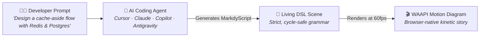

<p align="center">
  <a href="https://markdy.com">
    
  </a>
</p>

<p align="center">
  <strong>Diagram-as-code DSL for animated architecture &amp; system design explainers.</strong><br>
  Write declarative MarkdyScript → render 60fps browser-native kinetic diagrams powered by the Web Animations API.
</p>

<p align="center">
  <a href="https://markdy.com/playground/"><b>⚡ Live Studio</b></a> &nbsp;•&nbsp;
  <a href="https://marketplace.visualstudio.com/items?itemName=hoangyell.markdy-vscode"><b>🔌 VS Code Extension</b></a> &nbsp;•&nbsp;
  <a href="https://markdy.com/docs/"><b>📖 Documentation</b></a> &nbsp;•&nbsp;
  <a href="https://markdy.com/examples/"><b>🌟 29 Blueprints</b></a> &nbsp;•&nbsp;
  <a href="https://markdy.com/agent/"><b>🤖 AI &amp; Agent Guide</b></a>
</p>

<p align="center">
  <a href="https://github.com/HoangYell/markdy-com/actions/workflows/ci.yml"></a>
  <a href="https://marketplace.visualstudio.com/items?itemName=hoangyell.markdy-vscode"></a>
  <a href="https://open-vsx.org/extension/hoangyell/markdy-vscode"></a>
  <a href="https://www.npmjs.com/package/@markdy/core"></a>
  <a href="https://www.npmjs.com/package/@markdy/mcp-server"></a>
  <a href="https://www.npmjs.com/package/@markdy/core"></a>
  <a href="https://github.com/HoangYell/markdy-com/blob/main/LICENSE"></a>
</p>

<p align="center">
  <a href="https://markdy.com/playground/">
    
  </a>
</p>

---

## 🤖 The AI-First Paradigm: You Don't Write Code, AI Agents Do

> **Markdy is architected specifically for the AI Agent era.**  
> Humans shouldn't spend hours hand-drawing static architecture boxes, connecting arrows, or wrestling with complex visual layout tools.  
> **You describe your system flow in natural language → your AI Coding Agent consumes the Markdy spec → producing 60fps kinetic animations.**



### The 3-Step AI Workflow:

1. **Equip Your AI Agent with Markdy Context:**
   - **Via MCP Server:** Install `@markdy/mcp-server` into Cursor, VS Code, Claude, Antigravity, or Cline ([1-Click Install ↗](https://markdy.com/mcp/cursor)).
   - **Via Workspace Rules / Context:** Include [`AGENT.md`](docs/AGENT.md) in your workspace rules (`.cursorrules`, `CLAUDE.md`, `.agent/rules.md`), or reference [`https://markdy.com/llms-full.txt`](https://markdy.com/llms-full.txt).
2. **Describe Your System Architecture in Plain English:**
   > *"Generate an animated Markdy diagram for our distributed payment processor: Client sends request to API Gateway, Gateway dispatches to Payment Service, Payment Service writes to Postgres, syncs with Redis cache, and emits an async event to Kafka."*
3. **Instant 60fps Kinetic Choreography:**
   - The AI Agent generates complete, valid MarkdyScript with semantic nodes, directional flows (`->`, `<-`, `~>`), and animated `beat` timelines.
   - Preview immediately side-by-side in VS Code / Cursor with **`Cmd+K V`** or paste into the **[Markdy Web Studio](https://markdy.com/playground/)**.

---

## ⚡ Why Markdy?

Static boxes and arrows fail to capture distributed systems in action. **Markdy turns text into choreographed 60fps motion graphics** directly in your browser.

- 🎬 **Kinetic Storytelling**: Choreograph requests (`->`), responses (`<-`), and events (`~>`) across sequential `beat` timelines with auto-zooms and glow cues.
- 📐 **Zero-Config Layout**: Collision-aware orthogonal Manhattan edge routing and rank-based auto-layout.
- ⚡ **Zero-Dep & Web-Native**: Powered by pure CSS/SVG transforms and the Web Animations API (WAAPI) — ~14 kB parser, no Canvas, no GSAP.
- 🔄 **Universal Ingestion**: 1-click migration from Mermaid, Draw.io, Docker Compose, Kubernetes manifests, and Terraform states.
- 🤖 **AI-Native & MCP**: Official Model Context Protocol (MCP) server for Claude, Cursor, Antigravity, and Cline with self-healing syntax diagnostics.
- 🛡️ **Architecture Governance**: Built-in rules prevent deadlock cycles and cross-layer bypasses.

---

## 📦 Installation & Integrations

Choose your environment to get started with Markdy in seconds:

<details open>
<summary><b>🤖 AI Coding Agents &amp; MCP Server (Recommended)</b></summary>
<br>

Equip Claude, Cursor, Antigravity, VS Code, Cline, Windsurf, or Zed with self-healing syntax diagnostics, auto-repair, and transpilers:

```bash
# Claude Code / CLI
claude mcp add markdy -- npx -y @markdy/mcp-server

# Google Antigravity & Gemini CLI
agy mcp add markdy -- npx -y @markdy/mcp-server
```

👉 **[1-Click Install for Cursor ↗](https://markdy.com/mcp/cursor)** &nbsp;•&nbsp; **[1-Click Install for VS Code ↗](https://markdy.com/mcp/vscode)** &nbsp;•&nbsp; **[Detailed AI Setup Guide (`AGENT.md`) ↗](docs/AGENT.md)**
</details>

<details open>
<summary><b>🔌 IDE Extensions (VS Code, Cursor, Windsurf, VSCodium)</b></summary>
<br>

Live side-by-side animated preview (`Cmd+K V`), syntax highlighting, auto-completion, error squiggles, and SVG/PNG export:

```bash
# Visual Studio Code
code --install-extension hoangyell.markdy-vscode

# Cursor / VSCodium (Open VSX Registry)
cursor --install-extension hoangyell.markdy-vscode
```

👉 **[VS Code Marketplace ↗](https://marketplace.visualstudio.com/items?itemName=hoangyell.markdy-vscode)** &nbsp;•&nbsp; **[Open VSX Registry ↗](https://open-vsx.org/extension/hoangyell/markdy-vscode)** &nbsp;•&nbsp; **[Extension Docs ↗](packages/vscode/README.md)**
</details>

<details>
<summary><b>⚡ Terminal CLI &amp; Migration Suite (`@markdy/cli`, `@markdy/compat`)</b></summary>
<br>

Render standalone HTML diagrams, run linting in CI/CD, or convert legacy Mermaid, Draw.io, Docker Compose, Kubernetes, and Terraform configs:

```bash
# Global install
npm install -g @markdy/cli

# Render diagram to animated HTML or SVG
markdy render system.markdy --out diagram.html

# Transpile Mermaid / Docker Compose / Kubernetes to Markdy
markdy import flow.mmd --out flow.markdy
```

👉 **[CLI Package Guide ↗](packages/cli/README.md)** &nbsp;•&nbsp; **[Compat Transpiler Guide ↗](packages/compat/README.md)**
</details>

<details>
<summary><b>🌐 JavaScript / TypeScript Runtime (`@markdy/core`, `@markdy/renderer-dom`)</b></summary>
<br>

Integrate the ~14 kB parser and 60fps WAAPI rendering engine directly into your web applications, dashboards, or custom tooling:

```bash
pnpm add @markdy/core @markdy/renderer-dom
# or
npm install @markdy/core @markdy/renderer-dom
```

```ts
import { compile } from '@markdy/core';
import { createDiagram } from '@markdy/renderer-dom';

const { ast } = compile(markdyScriptCode);
const diagram = createDiagram(containerElement, ast);
diagram.play();
```

👉 **[@markdy/core Docs ↗](packages/core/README.md)** &nbsp;•&nbsp; **[@markdy/renderer-dom Docs ↗](packages/renderer-dom/README.md)**
</details>

<details>
<summary><b>🚀 Astro Integration (`@markdy/astro`)</b></summary>
<br>

Zero-CLS, SSR-placeholder islands with viewport-triggered lazy hydration for Astro documentation sites and blogs:

```bash
pnpm add @markdy/astro
```

```astro
---
import { Markdy } from "@markdy/astro";
import code from "./diagram.markdy?raw";
---

<Markdy code={code} client:visible />
```

👉 **[@markdy/astro Package Guide ↗](packages/astro/README.md)**
</details>

<details>
<summary><b>📝 MDX / React / Next.js Integration (`@markdy/mdx`)</b></summary>
<br>

Render fenced ```markdy code blocks directly inside `.mdx` files with automatic lazy loading:

```bash
pnpm add @markdy/mdx react react-dom
```

```ts
// mdx.config.js
import { remarkMarkdy } from "@markdy/mdx";

export default {
  remarkPlugins: [[remarkMarkdy, { componentName: "MarkdyDiagram" }]],
};
```

👉 **[@markdy/mdx Package Guide ↗](packages/mdx/README.md)**
</details>

<details>
<summary><b>🏗️ Systems Vocabulary &amp; Language Server (`@markdy/stdlib-systems`, `@markdy/language-server`)</b></summary>
<br>

- **[`@markdy/stdlib-systems`](packages/stdlib-systems/README.md)**: Standard library of semantic cloud and distributed systems node kinds.
- **[`@markdy/language-server`](packages/markdy-language-server/README.md)**: Headless LSP for custom editor integrations (Neovim, Helix, Emacs).
</details>

---

## 📊 Feature Comparison

| Capability | Mermaid / PlantUML | Excalidraw / Draw.io | Markdy |
|---|---|---|---|
| **Animation & Timing** | ❌ Static SVG / PNG | ❌ Static canvas | ✅ **60fps WAAPI motion & step-by-step narrative beats** |
| **Authoring Style** | Text DSL | Manual drag-and-drop | ✅ **Declarative text DSL + Live Editor Preview** |
| **Return Flows & Cycles** | ⚠️ Rank distortion / tangling | Manual curve placement | ✅ **Cycle-safe returns (`<-`) & async event arcs (`~>`)** |
| **AI Agent Reliability** | ⚠️ High hallucination | ❌ Coordinate hallucination | ✅ **Strict grammar AST + Self-healing MCP Server** |
| **Architecture Linter** | ❌ None | ❌ None | ✅ **Built-in rules (e.g. anti-pattern detection)** |
| **Universal Ingestion** | ❌ Manual rewrite | ❌ Manual export | ✅ **1-Click Transpiler for Mermaid, Compose, K8s, Terraform** |
| **Core Footprint** | ~2 MB+ runtime | Heavy web app | ✅ **~14 kB core parser, zero dependencies** |

---

## 🚀 Quick Start (60 Seconds)

### 1. Write MarkdyScript (`system.markdy`)

```markdy
scene "Cache-Aside Architecture" theme=midnight
layout LR

browser Client "Web Client"
gateway Gateway "API Gateway"
service Svc "URL Service"
cache Redis "Redis Cluster"
database Postgres "PostgreSQL 16"

beat cache_hit "1. Cache Hit Path":
  show $nodes stagger=60ms
  frame Client Gateway Svc Redis zoom=1.12
  Client -> Gateway "GET /link" -> Svc "resolve"
  Svc -> Redis "GET key:link"
  Svc <- Redis "200 Target URL"
  Client <- Gateway "301 Redirect"

beat cache_miss "2. Cache Miss & Async Warm":
  frame Svc Redis Postgres zoom=1.15
  Svc -> Postgres "SELECT destination WHERE key = 'link'"
  Svc <- Postgres "Row Found"
  Svc ~> Redis "SETEX key:link (Warm Cache)"
  glow Postgres color=#38bdf8 & glow Redis color=#22c55e
```

### 2. Choose Your Workflow

- **VS Code / Cursor**: Install [`hoangyell.markdy-vscode`](https://marketplace.visualstudio.com/items?itemName=hoangyell.markdy-vscode) and press **`Cmd+K V`** (macOS) or **`Ctrl+K V`** (Windows/Linux) for live preview.
- **Web Studio**: Open [markdy.com/playground](https://markdy.com/playground/) for interactive authoring and shareable links.
- **Terminal & CI/CD**: Run `npx @markdy/cli render system.markdy --out diagram.html`.
- **Astro / MDX Docs**: Use `<Markdy code={code} client:visible />` with `@markdy/astro` or `@markdy/mdx`.

---

## 📦 Component Responsibilities & Packages

Markdy is architected as a modular monorepo where each package fulfills a focused responsibility:

| Package | Responsibility | Primary Exports |
|---|---|---|
| **[`@markdy/core`](packages/core)** | **Compiler Core & AST Engine** | `parse()`, `compile()`, `formatScene()`, `diagnoseMarkdyCode()`, `validateArchitecture()`. Zero dependencies (~14 kB). |
| **[`@markdy/renderer-dom`](packages/renderer-dom)** | **Motion Graphics & Rendering** | `createDiagram()`, `exportDiagramAsVectorSvg()`, `exportDiagramAsPng()`, `exportDiagramAsGif()`. 60fps WAAPI timeline. |
| **[`markdy-vscode`](packages/vscode)** | **IDE Extension (VS Code & Cursor)** | Side-by-side live animated preview, document formatter (`Shift+Alt+F`), QuickFix lightbulbs (`💡 Fix`), Universal Ingestion, CodeLens. |
| **[`@markdy/compat`](packages/compat)** | **Universal Ingestion Suite** | Transpilers for Mermaid, Docker Compose, Kubernetes YAMLs, Terraform state, and Draw.io XML. |
| **[`@markdy/cli`](packages/cli)** | **Terminal Tool & CI/CD** | `markdy lint`, `markdy render`, `markdy format`, `markdy import`, `markdy diff`. |
| **[`@markdy/mcp-server`](packages/mcp-server)** | **AI Agent Integration (MCP)** | Model Context Protocol server exposing validation, auto-healing, and transpilation tools for Claude, Cursor, Antigravity, Cline, Windsurf. |
| **[`@markdy/astro`](packages/astro)** & **[`@markdy/mdx`](packages/mdx)** | **Docs & Blog Integrations** | Zero-CLS, SSR-placeholder islands with viewport hydration for content sites. |
| **[`@markdy/language-server`](packages/markdy-language-server)** | **Headless LSP Server** | Diagnostic publishing, hover docs, formatting, and completions for language clients. |
| **[`@markdy/stdlib-systems`](packages/stdlib-systems)** | **Domain Vocabulary** | Semantic primitives for cloud, infrastructure, and distributed systems. |

---

## 🔍 Detailed Features & Advanced Usage

<details>
<summary><b>🎨 17 Specialized Layout Engines &amp; 8 Editorial Themes</b></summary>
<br>

Markdy provides topological layout algorithms tailored to specific system patterns:

- **Distributed Systems**: `architecture`, `flowchart`, `tree`, `state`, `sequence`
- **Security & Structure**: `layers`, `nested`, `swimlane`, `quadrant`, `pyramid`
- **Data & Product Loops**: `medallion`, `timeline`, `gantt`, `flywheel`, `constellation`, `radar`, `venn`

**Themes**: `midnight` (dark modern), `paper` (light technical), `blueprint` (CAD cyan), `editorial` (serif publication), `graphite` (minimal dark), `nebula` (cosmic violet), `terminal` (CLI retro), `sketchy` (hand-drawn).

👉 *[Explore all 17+ interactive scenes in the Live Gallery ↗](https://markdy.com/examples/)*
</details>

<details>
<summary><b>🔄 Universal Ingestion (1-Command Migration)</b></summary>
<br>

Convert existing diagrams and infrastructure configs into animated MarkdyScript scenes:

```bash
markdy import flow.mmd            --out flow.markdy        # Mermaid.js Flowcharts & Sequences
markdy import docker-compose.yml  --out compose.markdy     # Docker Compose Services & Networks
markdy import k8s-manifests/      --out cluster.markdy     # Kubernetes Ingress, Pods & Services
markdy import terraform.tfstate   --out infra.markdy       # Terraform Provisioned State
markdy import architecture.drawio --out diagram.markdy     # Draw.io / diagrams.net XML
```
</details>

<details>
<summary><b>🤖 AI Coding Agents &amp; Model Context Protocol (MCP) Setup (Cursor, VS Code, Claude, Antigravity)</b></summary>
<br>

Equip your favorite AI Coding Agent with native Markdy tools (`validate_markdy_code`, `diagnose_markdy_syntax`, `fix_markdy_code`, `transpile_to_markdy`) and live specification resources (`markdy://spec/agent-reference`).

### ⚡ Quick MCP Server Setup & Installation

| AI Environment | Setup Action | Method |
|---|---|---|
| **Cursor** | [](https://markdy.com/mcp/cursor) | **[1-Click Install ↗](https://markdy.com/mcp/cursor)** or [JSON Config](#cursor-setup) |
| **VS Code / Copilot** | [](https://markdy.com/mcp/vscode) | **[1-Click Install ↗](https://markdy.com/mcp/vscode)** or [JSON Config](#vscode-setup) |
| **Claude Code & Desktop** | [](#claude-setup) | **CLI (`claude mcp add`) & JSON** |
| **Google Antigravity** | [](#antigravity-setup) | **1-Command CLI (`agy mcp add`)** |
| **Cline / Roo Code** | [](#cline-setup) | **Config File (`cline_mcp_settings.json`)** |
| **Windsurf / Cascade** | [](#windsurf-setup) | **Config File (`mcp_config.json`)** |
| **Zed Editor** | [](#zed-setup) | **Config File (`settings.json`)** |

---

### 🛠️ Client Configuration Snippets

<a id="claude-setup"></a>
#### 1. Claude Code & Claude Desktop

**Claude Code (Anthropic CLI):**
```bash
claude mcp add markdy -- npx -y @markdy/mcp-server
```

**Claude Desktop GUI (`claude_desktop_config.json`):**
```json
{
  "mcpServers": {
    "markdy": {
      "command": "npx",
      "args": ["-y", "@markdy/mcp-server"]
    }
  }
}
```

<a id="cursor-setup"></a>
<a id="vscode-setup"></a>
#### 2. Cursor & VS Code (`.cursor/mcp.json` or `.vscode/mcp.json`)
```json
{
  "mcpServers": {
    "markdy": {
      "command": "npx",
      "args": ["-y", "@markdy/mcp-server"]
    }
  }
}
```

<a id="antigravity-setup"></a>
#### 3. Google Antigravity & Gemini CLI

**Via 1-Command CLI:**
```bash
agy mcp add markdy -- npx -y @markdy/mcp-server
```

**Or via Config File (`~/.gemini/antigravity/mcp_config.json` or `.agents/mcp_config.json`):**
```json
{
  "mcpServers": {
    "markdy": {
      "command": "npx",
      "args": ["-y", "@markdy/mcp-server"]
    }
  }
}
```

<a id="cline-setup"></a>
#### 4. Cline & Roo Code (`cline_mcp_settings.json`)
```json
{
  "mcpServers": {
    "markdy": {
      "command": "npx",
      "args": ["-y", "@markdy/mcp-server"]
    }
  }
}
```

<a id="windsurf-setup"></a>
#### 5. Windsurf / Cascade (`~/.codeium/windsurf/mcp_config.json`)
```json
{
  "mcpServers": {
    "markdy": {
      "command": "npx",
      "args": ["-y", "@markdy/mcp-server"]
    }
  }
}
```

<a id="zed-setup"></a>
#### 6. Zed Editor (`settings.json`)
```json
{
  "context_servers": {
    "markdy": {
      "command": {
        "path": "npx",
        "args": ["-y", "@markdy/mcp-server"]
      }
    }
  }
}
```

---

### 🧰 Available Agent Tools & Resources

- 🔍 `validate_markdy_code`: Check syntax, unresolved node references, and cycle rules.
- 💡 `diagnose_markdy_syntax`: Detailed diagnostics with exact line numbers and remediation steps.
- 🩹 `fix_markdy_code`: Self-healing code repair that fixes common syntax mistakes and formats AST.
- 🔄 `transpile_to_markdy`: Convert Mermaid, Docker Compose, Kubernetes, Terraform, or Draw.io into valid MarkdyScript.
- 📚 `markdy://spec/agent-reference`: Full AST grammar reference and token catalog.
- 🏛️ `markdy://governance/rules`: Architecture rules (Well-Architected, cycle bounds, layer separation).
- 📦 `markdy://templates/catalog`: 29 production-grade architecture blueprints.

👉 *[Read the Full AI Agent Reference Guide (`AGENT.md`) ↗](https://markdy.com/agent/)*
</details>

---

## 📖 Documentation Links

| Guide | Description |
|---|---|
| **[Syntax Reference (SYNTAX.md)](docs/SYNTAX.md)** | Full DSL grammar, flow operators, selectors, cues, and player settings |
| **[Step-by-Step Tutorial (TUTORIAL.md)](docs/TUTORIAL.md)** | Step-by-step guide from basic flows to multi-beat kinetic scenes |
| **[AI Agent Guide (AGENT.md)](docs/AGENT.md)** | LLM system prompts, token rules, and anti-patterns |
| **[Architecture Internals (ARCHITECTURE.md)](docs/ARCHITECTURE.md)** | Compiler pipelines, WAAPI loop, and orthogonal routing geometry |
| **[VS Code Extension Guide](packages/vscode/README.md)** | Shortcuts, settings, and IDE features |

---

<p align="center">
  <br>
  <strong>Empowering engineers and AI agents to create living architecture diagrams.</strong><br>
  <sub>Built with ❤️ by <a href="https://hoangyell.com">Hoang Yell</a> &amp; the community. Distributed under the <a href="LICENSE">MIT License</a>.</sub>
</p>