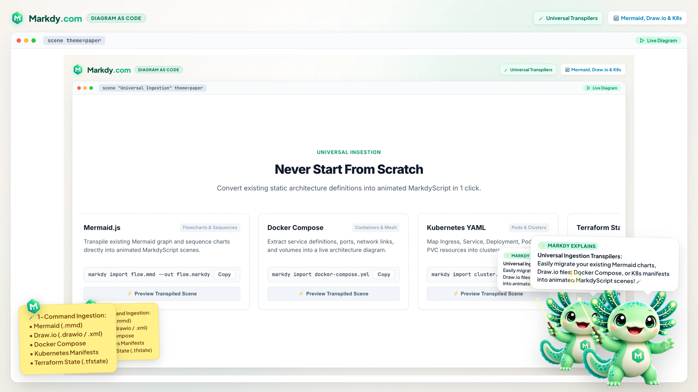

# Architecture

> ### INTERNAL ARCHITECTURE METADATA
> - **Status**: Active & Canonical
> - **Current Version**: v1.4.0
> - **Specification Version**: 1.4.x
> - **Last Updated**: 2026-09-05
> - **Engine Boundary**: `@markdy/core` (AST & Layout) -> `@markdy/renderer-dom` (WAAPI)

Technical deep dive into Markdy's design, data flow, and renderer internals.

---

## Design Principles

1. **Separation of concerns** — parsing and rendering are independent packages with a clean AST boundary
2. **Zero runtime dependencies** — `@markdy/core` has no deps; `@markdy/renderer-dom` depends only on `@markdy/core`
3. **Browser-native** — Web Animations API (WAAPI) for animation; no Canvas, no GSAP, no React
4. **Deterministic playback** — manual `currentTime` control ensures identical rendering across browsers
5. **Compile-time layout** — `parse` produces a `DiagramAST`; `compile` lays out nodes, routes edges, and schedules cues into a `RenderPlan`; the renderer just plays it back

---

## System Architecture

```
  ┌────────────────────────────────────────────────────────┐
  │  Universal Ingestion & Transpilers (@markdy/compat)    │
  │  • Mermaid (Flowchart & Sequence)                      │
  │  • Draw.io (.drawio / .xml)                            │
  │  • Docker Compose                                      │
  │  • Kubernetes Manifests                                │
  │  • Terraform State (.tfstate)                          │
  └──────────────────────────┬─────────────────────────────┘
                             │ MarkdyScript Source
                             ▼
  ┌────────────────────────────────────────────────────────┐
  │                    @markdy/core                        │
  │                                                        │
  │  • parse(source) ──────────────► DiagramAST            │
  │  • compilePlan(ast) ───────────► RenderPlan            │
  │  • validateArchitecture(ast) ──► Governance Violations │
  │  • diffDiagramASTs(ast1, ast2) ─► Evolution Plan & AST  │
  │  • classifyTechnology(name) ───► Semantic Profile      │
  │  • compressMarkdyToUrlHash() ──► Compressed State URL  │
  │  • routeOrthogonalEdge() ──────► Obstacle Clearance    │
  │  • analyzeAndBuildRepairPrompt()► Self-Healing Prompt  │
  └──────────────────────────┬─────────────────────────────┘
                             │ RenderPlan
                             ▼
  ┌────────────────────────────────────────────────────────┐
  │                @markdy/renderer-dom                    │
  │                                                        │
  │  • createDiagram(opts) ────────► Live DOM Scene        │
  │  • encodeGifSequence(frames) ──► Animated GIF89a File  │
  │  • exportDiagramAsVectorSvg() ─► Figma-ready SVG       │
  │  • DiagramPresentationController► Interactive KeyNav  │
  └──────────────────────────┬─────────────────────────────┘
                             │ Integrations
            ┌────────────────┼────────────────┐
            ▼                ▼                ▼
  ┌─────────────────┐ ┌─────────────┐ ┌───────────────────┐
  │  @markdy/astro  │ │ @markdy/cli │ │ @markdy/mcp-server│
  │  Island Hydrate │ │ Dev Tooling │ │ Claude / AI Tools │
  └─────────────────┘ └─────────────┘ └───────────────────┘
```

<p align="center">
  
</p>

---

## Package Details

### `@markdy/core`

**Zero runtime dependencies.** Runs in Node.js, Deno, Bun, edge runtimes, and the browser.

#### Parser Design

The parser reads indentation-aware blocks:

```
for each block in source:
  1. Match against statement patterns (scene, layout, style, node, group, edge, pattern, beat)
  2. Collect indented cue/member lines for beat/pattern/group colon bodies
  3. If a colon body has no indented children (MDX/JSX often strips whitespace),
     recover by reading same-indent lines until the next top-level statement
  4. Throw ParseError(lineNumber) on any unrecognised input
```

**Key implementation details:**

- **Strict grammar:** Statements outside the diagram grammar raise a line-numbered `ParseError`
- **Indent recovery:** Soft-body fallback silently recovers de-indented colon groups/beats/patterns instead of failing empty
- **Comment stripping:** `//` line comments are removed before parsing
- **Flow labels:** A trailing quoted string on a flow target becomes the edge label; response (`<-`) segments are stored in data-flow direction
- **Content-Adaptive Sizing:** When `width` and/or `height` are omitted from `scene`, `computeAdaptiveDimensions(ast)` analyzes diagram topology, rank depth, lifeline count, and tree span to derive the optimal canvas aspect ratio and dimensions (snapped to 16px grid multiples). Explicit user overrides (`width=... height=...`) are preserved untouched.
- **Compilation:** `compile(ast)` resolves dimensions, assigns ranks, positions nodes, routes edges, and schedules cues; `scene duration=` is otherwise derived from cue timing

#### AST Shape

```typescript
interface DiagramAST {
  meta: SceneMeta;                        // width, height, fps, theme, direction, type?, title?, duration?
  styles: Record<string, StyleDecl>;      // named node styles
  nodes: Record<string, NodeDecl>;        // { kind, id, label, style? }
  edges: EdgeDecl[];                       // static `edge` declarations
  groups: Record<string, GroupDecl>;       // named node sets
  patterns: Record<string, PatternDecl>;   // reusable cue templates
  annotations: AnnotationDecl[];           // optional editorial callouts
  beats: BeatDecl[];                       // [{ name, cues, ... }]
  diagnostics: Diagnostic[];               // non-fatal warnings
}
```

`compile(ast)` turns this into a `RenderPlan` with positioned nodes, routed edges, group boundaries, mode-specific sequence/tree/constellation geometry, timed cues, and beat ranges — the shape the renderer consumes.

---

### `@markdy/renderer-dom`

**Single dependency:** `@markdy/core`.

#### Module Structure

```
src/
  nodes.ts        — Node element factory + scene title
  edges.ts        — Flow-edge SVG runtime, routing, cue animations
  sequence.ts     — Participant lifelines, messages, activation spans
  tree.ts         — Shared tree-bus geometry
  groups.ts       — Group boundary zones
  annotations.ts  — Anchored editorial callouts
  constellation.ts — Nebula halos, orbit rings, deterministic stars
  geometry/       — Pure rect/point + obstacle-aware routing helpers
  theme.ts        — Scene ambience styles + theme-token application
  diagram.ts      — Public API, rAF loop, progress bar, responsive scaling
  index.ts        — Barrel exports (DiagramOptions, Diagram, createDiagram)
```

#### Playback Architecture

All WAAPI animations stay **permanently paused**. A `requestAnimationFrame` loop manually advances `sceneMs` and sets `anim.currentTime = sceneMs` on every animation each frame.

**Why not use WAAPI's native playback?**

Two browser-specific issues forced this design:

1. **`startTime` unreliability:** Setting `startTime` on a paused animation does not reliably change the play state to `"running"` across all browsers.

2. **`fill:"both"` cascade conflict:** With `fill:"both"`, later-created animations win the WAAPI cascade during their *before-phase*, overriding earlier animations' backward fill. This caused nodes to jump to their final state immediately instead of revealing progressively.

**Solution:** `fill:"forwards"` only + pre-initialised inline styles. Each node's before-phase falls through to the inline style set during setup, which gives correct initial positions and opacity values.

```
Frame loop:
  1. sceneMs += (now - lastTimestamp)
  2. for each animation: anim.currentTime = sceneMs
  3. updateProgressBar(sceneMs / totalDurationMs)
  4. requestAnimationFrame(next frame)
```

#### Node & Edge Element Creation

| Source | DOM Output |
|---|---|
| Node (`nodes.ts`) | `<div class="markdy-node markdy-scene-node" data-node data-role>` with a role-aware SVG glyph (or an `image=`/`logo=` ``) plus a label; named `style` props map to CSS variables such as node fill, stroke, text, and accent |
| Scene title | `<div>` positioned at the top-left of the scene |
| Edge (`edges.ts`) | `<svg>` overlay with a routed `<path>`, arrowhead marker, animated dash reveal, a moving packet dot, and an optional rounded label pill |
| Camera layer | A transformed content layer used by `frame` cues to guide attention without changing compiled node coordinates |
| Beat captions | Optional beat labels rendered as timed caption pills over the scene |

Node kind → semantic role → colour + icon mapping lives in `@markdy/core` (`system-vocabulary.ts`) and in `nodes.ts` (`iconKeyForNode`).

#### Cue Animations

Beat cues (`show`, `hide`, `glow`, `focus`, `frame`) and flow edges compile to WAAPI keyframes in `buildCueAnimations` (`edges.ts`). `show`/`hide` fade and lift nodes (with optional `stagger`); `glow`/`focus` add emphasis; `frame` transforms the camera layer around selected nodes or groups; the flow operators (`->`, `<-`, `~>`, `--`) drive the edge dash + packet reveal. Optional beat labels compile to caption animations in the renderer.

#### Animation Pre-Initialisation

Before building animations, the renderer pre-sets inline styles so the first frame is correct without `fill:"both"`: nodes revealed by a later `show` cue start hidden (`opacity: 0`) and slightly offset, then animate in when their cue begins.

---

### `@markdy/astro`

#### Hydration Strategy

```
Server → SSR placeholder <div> (correct size + bg colour)
           ↓ (browser)
IntersectionObserver (threshold: 1.0) watches .markdy-root
           ↓ (element fully visible in viewport)
observer.unobserve(el) → hydrate(el)
           ↓
createDiagram({ container: el, code, assets, autoplay, loop, copyright, progressBar })
```

- `data-markdy-code-b64` — MarkdyScript source, base64-encoded so HTML attribute whitespace normalization cannot strip indentation required by colon bodies
- `data-markdy-code` — legacy raw MarkdyScript attribute (still read as a fallback for older builds)
- `data-markdy-assets` — JSON-serialised asset overrides
- `data-markdy-autoplay` — `"true"` / `"false"`
- `data-markdy-loop` — `"true"` / `"false"`
- `data-markdy-copyright` — `"true"` / `"false"` (shows "Powered by Markdy" badge)
- `data-markdy-progress-bar` — `"true"` / `"false"` (shows rainbow border progress bar)
- `data-markdy-init` — prevents double-registration
- **View Transitions:** Listens for `astro:page-load` to re-observe new elements

---

## Build System

- **Bundler:** tsup (esbuild-based) producing ESM + `.d.ts`
- **Test runner:** vitest (48 parser tests)
- **Type checking:** TypeScript strict mode, `tsc --noEmit`
- **Monorepo:** pnpm workspaces
- **CI:** GitHub Actions matrix on Node 18 / 20 / 22

### Build Order

```
@markdy/core  →  @markdy/renderer-dom  →  @markdy/astro  →  @markdy/website
```

`@markdy/core` must build first — `@markdy/renderer-dom` imports from it.

---

## Extension Points

To add a new **node kind** (e.g., `graphql`):

1. Add the string to `TECHNICAL_NODE_TYPES` in [system-vocabulary.ts](../packages/core/src/system-vocabulary.ts)
2. Map it to a role in `TECHNICAL_NODE_KINDS` (e.g., `graphql: "compute"`) — color/styling follow from the role
3. Document in [SYNTAX.md](SYNTAX.md) and [AGENT.md](AGENT.md)

To add a new **cue** (e.g., `pulse`):

1. Add the keyword to `BEAT_CUE_KEYWORDS` in [registry.ts](../packages/core/src/registry.ts)
2. Parse it in `parseCueLine` and extend the `Cue` union in [ast.ts](../packages/core/src/ast.ts)
3. Schedule it in `scheduleBeats` in [compiler.ts](../packages/core/src/compiler.ts)
4. Animate it in `buildCueAnimations` in [edges.ts](../packages/renderer-dom/src/edges.ts)

To add a new **flow operator / edge kind**:

1. Add the operator to `EDGE_OPERATORS` in [registry.ts](../packages/core/src/registry.ts) and the `EdgeKind` union in [ast.ts](../packages/core/src/ast.ts)
2. Add its color to each theme's `edges` map in [themes.ts](../packages/core/src/themes.ts)
3. Add a stroke/marker style to `EDGE_STYLES` in [edges.ts](../packages/renderer-dom/src/edges.ts)
4. Document everywhere
