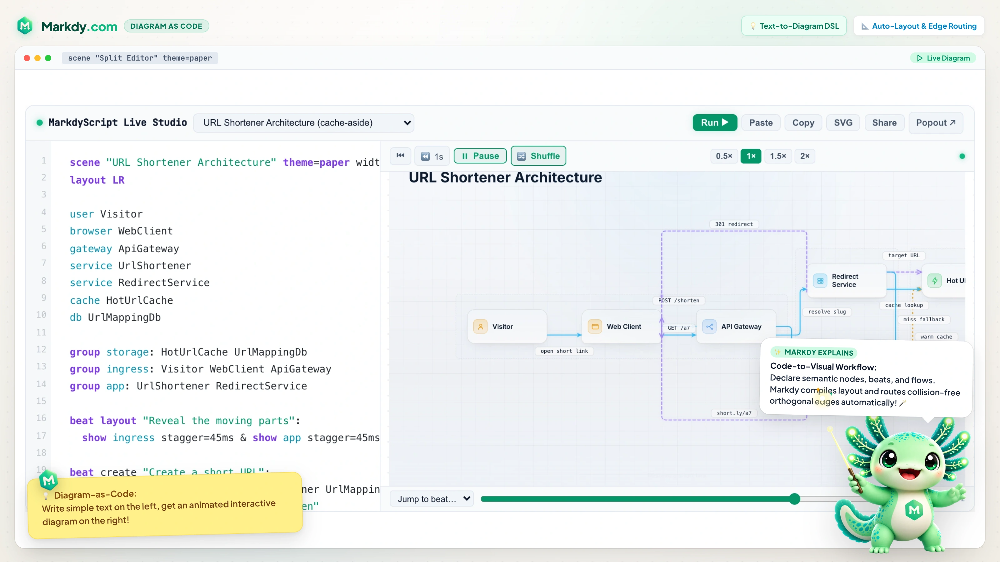

# Getting Started with Markdy

> ### DOCUMENTATION METADATA
> - **Status**: Active & Canonical
> - **Current Version**: v1.0.22
> - **Specification Version**: 1.0.x
> - **Last Updated**: 2026-08-23
> - **Documentation Hub**: <https://markdy.com/docs/>
> - **Quickstart Command**: `npm install -g @markdy/cli`

Markdy is an open-source, diagram-as-code DSL for animated architecture diagrams, system visualization, docs-as-code workflows, and AI-generated technical explainers. MarkdyScript is diagram-native: you declare semantic nodes, groups, beats, flows, and cues instead of drawing shapes by hand.

Use this guide when you want to answer: "How do I turn semantic nodes, groups, beats, and flows into an animated developer diagram?"

## 1. Write a scene file

Create `architecture.markdy`:

```markdy
scene theme=paper
layout LR

browser WebApp
service ApiServer
database Postgres

beat main:
  show $nodes stagger=80ms
  WebApp -> ApiServer "GET /users" -> Postgres "query"
  WebApp <- ApiServer "200 OK"
```

<p align="center">
  
</p>

Node labels are optional. IDs like `ApiServer` and `OrdersDb` render as readable labels such as `API Server` and `Orders DB`.

## 2. Preview and validate it

For a quick visual pass, open the dedicated playground at <https://markdy.com/playground/> and start from one of the shipped architecture examples. It uses the same `.markdy` files from `examples/showcase/`, shows syntax-highlighted MarkdyScript, offers an adjustable editor/preview split, and links back to each source file.

<p align="center">
  
</p>

```sh
npm i -D @markdy/cli
npx markdy lint architecture.markdy
npx markdy render architecture.markdy --out architecture.html
```

The full architecture node vocabulary ships inside Markdy, so no registration step is needed. `@markdy/stdlib-systems` is an optional re-export/manifest of that vocabulary for tooling.

## 3. Pick the right integration

Use the scene file directly when you can. Reach for package APIs only when you need to embed or automate it.

| Goal | Use |
|---|---|
| Preview, lint, format, import, or diff files | `@markdy/cli` |
| Transpile Mermaid, Draw.io, Docker Compose, K8s, Terraform | `@markdy/compat` |
| AI Agent integration for Claude, Cursor, Antigravity | `@markdy/mcp-server` |
| Embed in Astro docs | `@markdy/astro` |
| Write fenced code blocks in MDX | `@markdy/mdx` |
| Build a custom browser embed or export SVG/GIF | `@markdy/renderer-dom` |
| Parse, diff, or audit architecture rules in tooling | `@markdy/core` |
| Autocomplete and diagnostics in editors | `@markdy/language-server` |
| Architecture node vocabulary manifest | `@markdy/stdlib-systems` (optional) |

## 4. Use examples as templates

Start from `examples/showcase/` when building architecture visualization:

- URL shortener architecture
- Twitter timeline service
- YouTube processing pipeline
- OAuth / OIDC login flow
- Kubernetes cluster architecture

Start from top-level `examples/*.markdy` when learning one syntax feature at a time.

The docs showcase uses compact pattern labels (`cache-aside`, `fan-out`, `pipeline`, `auth-flow`, `platform`, `ci-cd`) so you can pick examples by architecture shape instead of reading long descriptions.

## 5. Validate scenes before publishing

```sh
pnpm run verify:examples
markdy lint path/to/scene.markdy
markdy render path/to/scene.markdy --out preview.html
```

## 6. Prompt an AI coding agent

Use <https://markdy.com/AGENT.md> as the full grammar reference, but prompt with your idea in normal product or architecture language. The AI should translate that idea into valid MarkdyScript.

<p align="center">
  
</p>

Example prompt:

> Use the Markdy agent guide to write one complete MarkdyScript scene. I want to explain a URL shortener: first a user creates a short link, then someone opens the short link and gets redirected. Show the API, URL service, Redis cache, and database. Make the animation clear enough for a short engineering demo.
