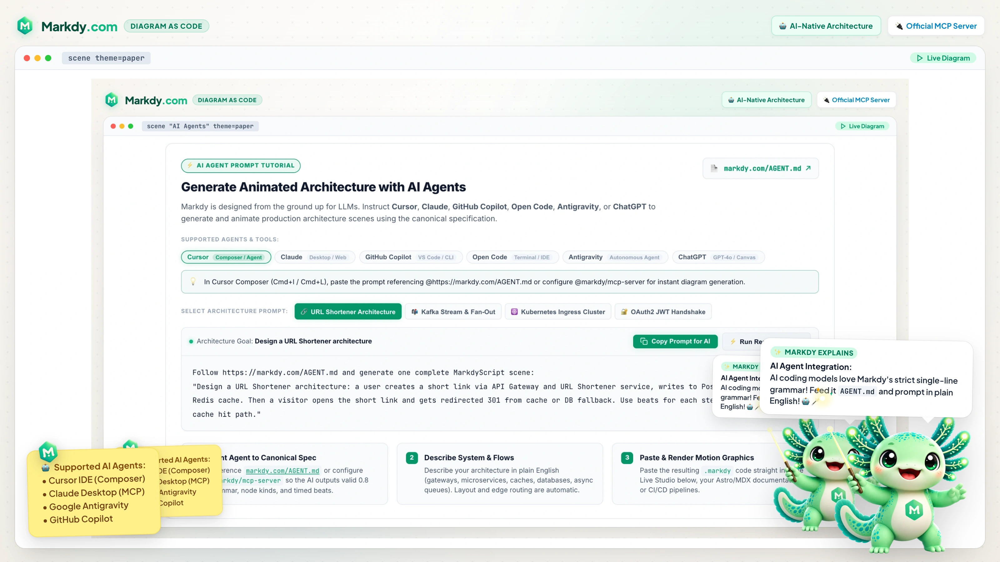

# Markdy Guides and Best Practices

> ### DOCUMENTATION METADATA
> - **Status**: Active & Canonical
> - **Current Version**: v1.0.22
> - **Specification Version**: 1.0.x
> - **Last Updated**: 2026-08-23
> - **Documentation Hub**: <https://markdy.com/docs/>
> - **AI Reference**: <https://markdy.com/AGENT.md>

This guide focuses on real problems developers search for: animated architecture diagrams, Mermaid-style diagrams with motion, docs-as-code animation, and AI-generated technical explainers.

## Design an animated architecture diagram

1. Pick one story: write path, read path, deploy path, auth flow, or failure recovery.
2. Use semantic node kinds: `client`, `service`, `database`, `queue`, `cache`, `cloud`, `container`, and `cluster`.
3. Declare nodes first; auto-layout positions them from your flows.
4. Use `->` and `<-` for synchronous calls; use `~>` for events and `--` for dependencies.
5. Use separate `beat` blocks to separate phases.
6. End with one visual takeaway: `glow` or `focus`.

  

## Make diagrams readable in documentation

- Keep edge labels under 28 characters when possible.
- Avoid overlapping nodes; leave room for routed edges.
- Use the `paper` theme for default docs and onboarding examples; use `editorial` for flat documentation scenes, `nebula` for radial/surreal scenes, or `midnight`, `blueprint`, and `graphite` for darker technical canvases.
- Choose `type=flowchart`, `tree`, `state`, `sequence`, or `constellation` when the story is a process, hierarchy, lifecycle, ordered interaction, or radial signal map rather than a general architecture graph.
- Prefer `group name: ...` plus `show name stagger=...` for clean reveals.
- Add emphasis (`glow`, `focus`) only after the viewer understands the full layout.

## Build docs-as-code workflows

- Store each scene as a `.markdy` file.
- Review scene changes in pull requests like code.
- Render previews in CI or during docs builds.
- Keep examples small enough to load quickly in documentation pages.
- Use <https://markdy.com/AGENT.md> as the source for AI-generated scenes.

## Use Markdy with AI agents

Markdy works well with AI because it is constrained:

- one statement per line
- typed node kinds and flow operators
- line-numbered parse errors
- deterministic rendering
- small diffs

  

Ask AI agents for concrete scenes:

> Create a Markdy scene for a Kubernetes ingress request. Use a browser, ingress, service, pod, Redis cache, and Postgres database. Animate the request path and cache miss path in separate beats.

Then ask the agent to shorten labels, avoid overlapping nodes, split phases into beats, add a final `glow`, and validate against <https://markdy.com/AGENT.md>.

## Production embedding checklist

- Use `@markdy/astro` or `@markdy/mdx` for content sites.
- Set fixed scene dimensions to avoid layout shift.
- Respect reduced-motion preferences at the page level.
- Avoid loading remote assets without cache control.
- Keep parser and renderer package versions aligned.
- Run `markdy lint` or `pnpm run verify:examples` before publishing.
