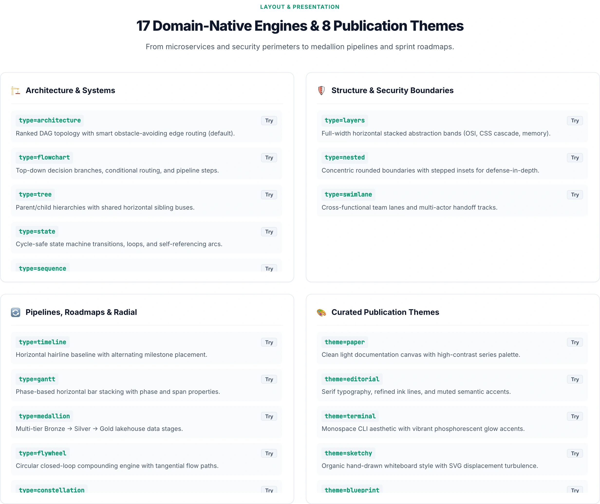

# MarkdyScript Syntax Reference

> ### SPECIFICATION METADATA
> - **Status**: Active & Canonical
> - **Current Version**: v1.0.28
> - **Specification Version**: 1.0.x
> - **Last Updated**: 2026-08-24
> - **Documentation Hub**: <https://markdy.com/docs/>
> - **AI Agent Guide**: <https://markdy.com/AGENT.md>

## MarkdyScript — Diagram-Native Grammar

MarkdyScript is diagram-native. Declare semantic nodes, groups, beats, flow operators, and cues — the engine handles layout, routing, timing, and rendering.

### Scene & Directives

```markdy
scene theme=paper
layout LR

browser Client
service API

beat request:
  show $nodes
  Client -> API "GET /orders"

player:
  playback:
    loop false
    rate 1.5

  controls:
    theme true
    speeds "0.5 1 2"
    fullscreen true
    share true

  interaction:
    zoom true
    pan true
    click_to_play true
    double_click_to_reset true
    keyboard true

  chrome:
    badge false
    progress boundary
    color "#3b82f6"
```

Canonical scenes put `layout LR|RL|TB|BT` on its own line and optional `player:` configuration at the bottom. The parser accepts `player:` elsewhere, plus `layout LR` or `layout=LR` on the `scene` line, for compatibility.

`player:` owns everything outside the diagram scene itself, split into four groups:

| Group | Owns | Settings |
|---|---|---|
| `playback:` | when and how fast the timeline runs | `autoplay`, `loop`, `rate` |
| `controls:` | which toolbar affordances are mounted | `play`, `restart`, `prev_beat`, `next_beat`, `seek`, `speed`, `speeds`, `fit`, `reset_view`, `fullscreen`, `svg`, `share`, `code` |
| `interaction:` | what pointer and key input do | `zoom`, `pan`, `click_to_play`, `double_click_to_reset`, `keyboard` |
| `chrome:` | non-interactive decoration | `badge`, `progress` (`none\|bar\|boundary`), `color` |

Toolbar controls are opt-in: only affordances explicitly set to `true` are mounted. When none are enabled, the toolbar is omitted; the footer remains only when the badge is enabled. `reset_view` additionally requires interaction, and `click_to_play` is independent of viewport gestures.

The subtle "Powered by Markdy" link remains visible at the right edge of the footer by default. It links to the Markdy playground with the current source encoded in the URL; set `chrome.badge false` or the renderer's `copyright` option to `false` to hide it.

`fit` mounts a toggle that frames every item in the scene and pins the camera, so `frame`/`focus` zoom cues stop moving the view while it is active. Toggling it off, pressing `reset_view`, or double-clicking restores normal camera motion. `fullscreen` toggles browser fullscreen presentation for the diagram container.

`prev_beat` and `next_beat` step through beats and only appear when the scene has more than one. `rate` sets the initial playback multiplier; `speeds` sets the choices offered to viewers (`speeds "0.25 1 3"`). The speed selector is omitted unless `speed true` provides at least two distinct positive choices.

`keyboard` is the one affordance that stays **off** unless you ask for it, because it listens on the window and captures space and arrow keys: <kbd>←</kbd>/<kbd>→</kbd> step beats, <kbd>Space</kbd> toggles playback, and <kbd>Home</kbd> restarts.

`svg` downloads the settled final frame as vector SVG. `share` copies a compressed share link; hosts can point it at their own editor with the renderer's `shareUrl` option, and it defaults to the Markdy playground. `code` opens a dialog displaying the raw MarkdyScript source code with syntax tinting and copy button.

Settings accept camel case or snake case, and `key value`, `key: value`, or `key = value`. Omitted renderer, Astro, or MDX props preserve script configuration; host `false` gates controls or interaction, while host `true` supplies legacy defaults for unset leaves. Legacy top-level directives, flat `player:` keys, and inline scene properties such as `controls true`, `interactive true`, `speed 1.5`, and `scene autoplay=false` are normalized into the same groups.

`markdy fmt` preserves this behavior while canonicalizing aliases and indentation into a grouped block at the bottom.

### Nodes

```markdy
browser Browser
service API "API Gateway"
database UrlDB "URL Store"
```

Supported semantic node kinds are categorized by system role: compute (`service`, `api`, `worker`, `lambda`), client (`browser`, `user`, `mobile`), storage (`database`, `db`, `cache`, `bucket`), messaging (`queue`, `topic`, `kafka`), network (`gateway`, `cdn`, `cloud`), platform (`container`, `cluster`, `pod`), security (`auth`, `vault`), delivery (`pipeline`, `repo`), observability (`monitor`, `metrics`), flowchart (`start`, `end`, `decision`), and distributed (`replica`, `shard`, `leader`). See [AGENT.md](AGENT.md) for the full exhaustive reference.

### Groups

```markdy
group storage: Redis UrlDB
```

### Beats and flows

```markdy
beat create "Create a short URL":
  show $nodes stagger=60ms
  frame app zoom=1.15 dur=600ms
  Browser -> API "POST /shorten" -> Shortener
  Shortener ~> Redis "warm cache"
  Browser <- Shortener "short.ly/a7"
```

The optional beat label is rendered as a short caption during that beat.

Canonical beat and pattern blocks end with `:` and use indentation. The parser also accepts `{ ... }` block delimiters and `#` comments because LLMs often emit that style, but generated documentation should prefer the colon form above.

When a host strips indentation (common with MDX/JSX template literals), the parser recovers colon bodies by reading until the next top-level statement. Prefer keeping real indentation or loading MarkdyScript from a raw `.markdy` file when you control the embed path; use brace blocks only when a host cannot preserve indentation.

Flow operators:
- `->` — Forward request/call (determines forward layout rank)
- `<-` — Response/return value (excluded from ranking to prevent cycles)
- `~>` — Asynchronous event or pub-sub message
- `--` — Structural/dependency link

### Patterns

```markdy
pattern lookup(client, store):
  $client -> $store "lookup"
  $client <- $store "result"

beat main:
  use lookup(API, DB)
```

### Themes

- `paper` — clean light documentation canvas (default)
- `editorial` — flat editorial paper with serif titles and semantic ink/accent roles
- `terminal` — dark CLI/TUI canvas with monospace font and neon glow accents
- `sketchy` — organic hand-drawn whiteboard theme with displacement filter
- `nebula` — deep-space canvas with orbit rings, signal halos, and constellation decoration
- `midnight` — dark developer canvas
- `blueprint` — technical blueprint CAD canvas
- `graphite` — restrained dark minimal canvas

<p align="center">
  
</p>

### Diagram types (opt-in)

Add `type=` on the scene line to tune layout and node shapes without changing the core grammar:

<p align="center">
  
</p>

| Type | Layout behavior |
|---|---|
| `architecture` | Default ranked graph (LR/TB from `layout`) |
| `flowchart` | Top-down process/decision shapes |
| `tree` | Parent/child tiers with shared sibling buses |
| `state` | Cycle-safe state placement and transition routing |
| `sequence` | Participant columns, lifelines, ordered messages, and activations |
| `timeline` | Horizontal hairline baseline with alternating above/below milestone placement |
| `gantt` | Phase-based horizontal bar stacking with `phase=` and `span=` properties |
| `venn` | 2–3 circle concept intersection with automatic proximity scaling |
| `layers` | Full-width horizontal stacked abstraction bands (OSI, CSS cascade, memory models) |
| `nested` | Concentric rounded boundaries with stepped insets for defense-in-depth and security scopes |
| `radar` | Multi-axis polygon comparison chart with series color palette |
| `medallion` | Multi-tier Bronze → Silver → Gold data lakehouse stages |
| `flywheel` / `loop` | Circular closed-loop engine with tangential flow paths |
| `quadrant` | 2×2 decision and strategic positioning matrix |
| `swimlane` | Multi-tier cross-functional horizontal lane partitions |
| `pyramid` | Hierarchical tier pyramid with step-proportional width scaling |
| `constellation` | Radial focal-node layout with deterministic orbit decoration |

```markdy
scene theme=editorial type=timeline
service Alpha "Alpha v0.1"
service Beta "Beta v0.5" focal=true
service GA "GA v1.0"
```

### Visual primitives & semantic node kinds

Optional visual primitives parse as nodes and reuse semantic styling. `stat`/`metric` accept `value=...`:

- **Containers & Surfaces**: `surface`/`panel`, `terminal`, `matrix`/`grid`, `track`/`lane`
- **Data & Storage**: `database`, `storage`, `bucket`, `cache`, `queue`
- **Markers & Tokens**: `dot`/`marker`, `chips`/`token_strip`, `glyph`/`glyph_card`
- **Semantic Roles**: `external` (dashed outside-scope boundary), `optional` (faded pending feature)
- **Metrics**: `stat`/`metric` (`value="142 ms"`)

```markdy
stat P95Latency "P95 latency" value="142 ms"
matrix Regions "Deployment matrix"
storage S3DataLake "Object Storage"
external CivilRegistry "External CRVS API"
```

### Structural edges

Declare persistent topology outside beats; renderer draws it behind animated flow edges. `$edges` can target persistent or animated edges for `show`, `hide`, `glow`, `focus`, and `frame`:

```markdy
edge backbone: Client -> Gateway -> API
```

### Editorial Annotations

Up to two editorial callouts anchor to a node with optional color `intent`:

```markdy
annotation "Hot path bottleneck" target=Redis position=top-right intent=accent
annotation "Offline sync mode" target=LocalDb position=bottom-left intent=muted
```

Supported intents: `neutral` (default ink), `accent` (coral/accent leader), `muted` (subtle secondary tone).

### Cues

| Cue | Description | Parameters |
|---|---|---|
| `show` | Reveal nodes, groups, or edges | `stagger`, `dur` |
| `hide` | Fade nodes or edges out | `dur` |
| `glow` | Emphasize with a colored glow | `color`, `strength`, `dur` |
| `focus` | Pulse-scale nodes to draw attention | `zoom`, `dur` |
| `frame` | Move the scene camera to a node or group | `zoom`, `dur` |
| `use` | Expand a pattern | pattern args |

Selectors: `$nodes`, `$edges`, `$groupName`, and declared `group` ids.

`frame $nodes` returns the camera to the full diagram — a good final cue for looping scenes.

For parallel cues, prefer `cue A & cue B` on one line. A leading `& cue B` continuation on the next line is accepted for AI-generated compatibility.
