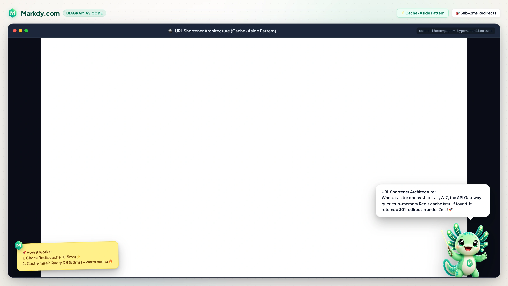

# MarkdyScript Tutorial

> ### DOCUMENTATION METADATA
> - **Status**: Active & Canonical
> - **Current Version**: v1.0.26
> - **Specification Version**: 1.0.x
> - **Last Updated**: 2026-08-24
> - **Documentation Hub**: <https://markdy.com/docs/>
> - **Playground**: <https://markdy.com/playground/>
>
> **Prerequisites:** Basic familiarity with any text editor. No programming required to write MarkdyScript.

---

## Table of Contents

1. [Learning Path](#learning-path)
2. [Your First Diagram](#1-your-first-diagram)
3. [Flow Edges](#2-flow-edges)
4. [Beats & Cues](#3-beats--cues)
5. [Groups](#4-groups)
6. [Patterns](#5-patterns)
7. [Styles & Themes](#6-styles--themes)
8. [Putting It All Together](#7-putting-it-all-together)
9. [Quick Reference](#quick-reference)

---

## Learning Path

Use this path when learning Markdy for animated diagrams, architecture visualization, and AI-generated technical explainers:

1. **Quick Start** — try a shipped scene in the dedicated playground at <https://markdy.com/playground/>, then install `@markdy/core` and `@markdy/renderer-dom` when you are ready to embed.
2. **Core Concepts** — understand scenes, node kinds, flow operators, beats, and cues.
3. **Basic Examples** — declare nodes, connect them, and reveal them beat by beat.
4. **Real-World Examples** — study URL shorteners, OAuth, Kubernetes, video pipelines, and timeline services in `examples/showcase/`.
5. **Best Practices** — keep labels short, avoid overlap, use semantic node kinds, and split long flows across beats.
6. **Advanced Features** — use `group`, `pattern`/`use`, `style`, beat captions, and `frame`.
7. **AI Agent Workflow** — give <https://markdy.com/AGENT.md> to the model, ask for MarkdyScript, lint it, and iterate on layout/timing.
8. **Production Use Cases** — embed in Astro/MDX docs, launch posts, onboarding, architecture reviews, and internal platform docs.

Quick install:

```sh
npm i @markdy/core @markdy/renderer-dom
```

The playground is the fastest feedback loop: it keeps the editor syntax-highlighted, links each curated example to its source `.markdy` file, gives the editor and preview an adjustable split, and surfaces parse warnings before you copy a scene into your project.

AI prompt starter:

> Follow <https://markdy.com/AGENT.md> and write one complete MarkdyScript scene. I want to explain OAuth login to frontend and backend engineers: the user clicks sign in, the app redirects to the identity provider, the provider returns a code, the backend exchanges it for tokens, then the app shows the signed-in session. Make it clear, presentation-friendly, and easy to paste into the Markdy playground.

---

## 1. Your First Diagram

Every scene starts with a `scene` line, then node declarations. A node is `<kind> <Id> ["Label"]`.

```markdy
scene theme=paper
layout LR

browser Client
service API
database DB "Postgres"
```

That already renders three positioned nodes — you never place them by hand. Add a `beat` to reveal them:

```markdy
beat main:
  show $nodes stagger=80ms
```

`$nodes` targets every node; `stagger` offsets each reveal so they cascade in.

---

## 2. Flow Edges

Connect nodes with the four flow operators. Chain hops on one line and add a `"label"` after any target.

```markdy
beat requests:
  Client -> API "GET /users" -> DB "query"
  Client <- API "200 OK"
```

| Operator | Edge kind | Rendered as |
|---|---|---|
| `->` | request | solid directed arrow |
| `<-` | response | dashed arrow, drawn back to the caller |
| `~>` | event | dotted async / publish arrow |
| `--` | dependency | thin structural link |

Edges route automatically around other nodes, and labels place themselves clear of the boxes.

---

## 3. Beats & Cues

A `beat` groups cues that play in order; beats run one after another. Besides `show`, cues let you direct attention.

```markdy
beat highlight "Inspect the database path":
  frame API DB zoom=1.15
  glow API color=#22c55e
  focus DB zoom=1.1
```

| Cue | Parameters | What it does |
|---|---|---|
| `show` | `stagger`, `dur` | Reveal nodes or a group |
| `hide` | `dur` | Fade nodes out |
| `glow` | `color`, `strength`, `dur` | Colored emphasis glow |
| `focus` | `zoom`, `dur` | Pulse-scale a node |
| `frame` | `zoom`, `dur` | Move the camera to nodes or a group (`frame $nodes` resets the view) |

Run two cues together by putting `&` between them:

```markdy
beat intro:
  show Client API & glow API color=#38bdf8
```

---

## 4. Groups

Name a set of nodes with `group`, then target them all at once.

```markdy
group storage: DB Redis

beat reveal:
  show storage stagger=80ms

beat highlight:
  glow storage color=#22c55e
```

---

## 5. Patterns

Define a reusable flow once with `pattern`, then expand it anywhere with `use`. `$params` are substituted at the call site.

```markdy
pattern lookup(client, store):
  $client -> $store "lookup"
  $client <- $store "result"

beat main:
  use lookup(API, DB)
  use lookup(API, Redis)
```

---

## 6. Styles & Themes

Pick a semantic `theme` on the scene line, and a `layout` direction. Override an individual node with a named `style`.

```markdy
scene theme=paper
layout TB

style hot = fill=#f59e0b

database Primary "Primary DB" style=hot
database Replica "Read Replica"
```

- Themes: `paper` (clean light, default), `editorial` (flat editorial paper with serif headings), `terminal` (CLI/TUI dark mode), `sketchy` (hand-drawn whiteboard), `nebula` (radial/surreal), `midnight` (dark developer), `blueprint` (CAD cyan-grid), and `graphite` (dark minimal).
- Directions: `LR` (default), `RL`, `TB`, `BT`.
- Focused layout modes: `architecture` (default), `flowchart`, `tree`, `state`, `sequence`, `timeline`, `gantt`, `venn`, `layers`, `nested`, `radar`, `medallion`, `flywheel`/`loop`, `quadrant`, `swimlane`, `pyramid`, and `constellation`.
- Named styles currently support visual props such as `fill`, `stroke`, `text`, and `accent`.

<p align="center">
  
</p>

---

## 7. Putting It All Together

```markdy
scene theme=paper
layout LR

user Visitor
browser Browser
gateway Gateway "API Gateway"
service Shortener "URL Shortener"
cache Redis "Hot URL Cache"
database UrlDB "URL Mapping DB"

group storage: Redis UrlDB

beat layout "Reveal the architecture":
  show $nodes stagger=60ms

beat create "Create a short URL":
  frame Browser Gateway Shortener zoom=1.12
  Browser -> Gateway "POST /shorten" -> Shortener
  Shortener -> UrlDB "store slug" & Shortener ~> Redis "warm cache"
  Browser <- Shortener "short.ly/a7"

beat redirect "Resolve the link":
  frame Visitor Browser Gateway Shortener zoom=1.08
  Visitor -> Browser "open link" -> Gateway "GET /a7" -> Shortener
  Shortener -> Redis "cache lookup"
  Browser <- Shortener "301 redirect"

beat finish "Storage keeps it fast":
  frame storage zoom=1.18
  glow storage color=#22c55e
```

<p align="center">
  
</p>

---

## Quick Reference

### Statement types

| Statement | Example |
|---|---|
| Scene | `scene theme=paper` |
| Layout | `layout LR` |
| Node | `service API "Checkout API"` |
| Group | `group storage: DB Redis` |
| Style | `style hot = fill=#f59e0b` |
| Static edge | `edge e1: A -> B "call"` |
| Pattern | `pattern name(a, b):` |
| Beat | `beat main:` |

### Flow operators

| Operator | Kind |
|---|---|
| `->` | request |
| `<-` | response |
| `~>` | event |
| `--` | dependency |

### Cues (inside a beat)

| Cue | Purpose |
|---|---|
| `show` / `hide` | reveal / hide nodes |
| `glow` | colored emphasis |
| `focus` | attention pulse |
| `frame` | camera move to nodes/groups |
| `use` | expand a pattern |
| `&` | run two cues in parallel |

### Selectors

| Selector | Targets |
|---|---|
| `$nodes` | every node |
| a group name | that group's members |
| a node id | that single node |
