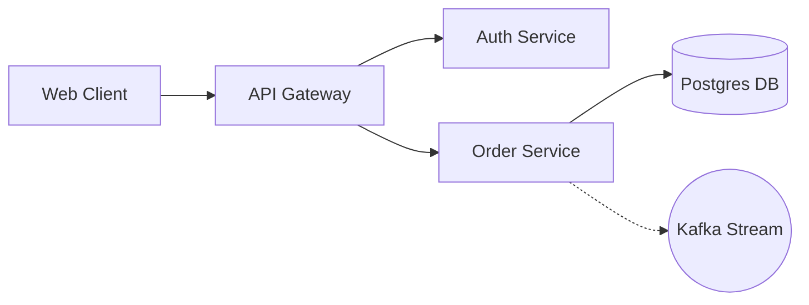

# Mermaid to Markdy Migration Guide

How to transition from static Mermaid.js diagrams to interactive, animated Markdy scenes.

---

<p align="center">
  
</p>

## ⚡ 1-Command Automatic Transpilation

You can automatically transpile existing Mermaid `.mmd` files into MarkdyScript using the CLI or MCP server:

```sh
# Using Markdy CLI
npx @markdy/cli import my-flow.mmd --out my-flow.markdy
```

---

## 📊 Syntax Comparison Table

| Feature | Mermaid.js | MarkdyScript |
|---|---|---|
| **Header** | `flowchart LR` or `sequenceDiagram` | `scene "Title" theme=paper`<br>`layout LR` |
| **Node Declaration** | `A[Client App]`<br>`B[(PostgreSQL)]` | `browser Client "Client App"`<br>`database DB "PostgreSQL"` |
| **Forward Request** | `A --> B` | `Client -> DB "query"` |
| **Return / Response** | `B --> A` *(creates cycles)* | `Client <- DB "result"` *(cycle-safe)* |
| **Async Event** | `A -.-> B` | `Client ~> EventBus "emit"` |
| **Animation & Timing** | ❌ None (Static SVG) | ✅ `beat step1: show $nodes` + animated flows |
| **Camera Focus** | ❌ None | ✅ `frame NodeA NodeB zoom=1.15` |
| **Themes** | ⚠️ Basic CSS variables | ✅ 8 publication themes (`paper`, `terminal`, `editorial`, `midnight`, `blueprint`...) |

---

## 🔄 Side-by-Side Example

### Before (Mermaid.js):


### After (MarkdyScript):
```markdy
scene "Order Processing" theme=paper
layout LR

browser Client "Web Client"
gateway Gateway "API Gateway"
service Auth "Auth Service"
service Orders "Order Service"
database DB "Postgres DB"
queue Kafka "Kafka Stream"

beat main "Complete Order Transaction":
  show $nodes stagger=60ms
  Client -> Gateway "POST /orders"
  Gateway -> Auth "verify JWT"
  Gateway <- Auth "valid"
  Gateway -> Orders "process"
  Orders -> DB "INSERT order"
  Orders ~> Kafka "order.created"
  Client <- Gateway "201 Created"
  glow Orders color=#10b981
```
