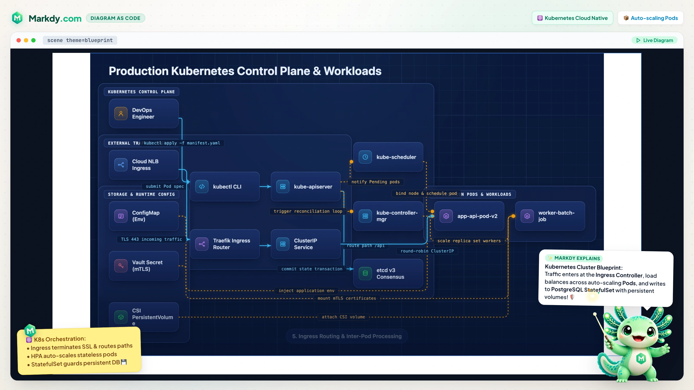
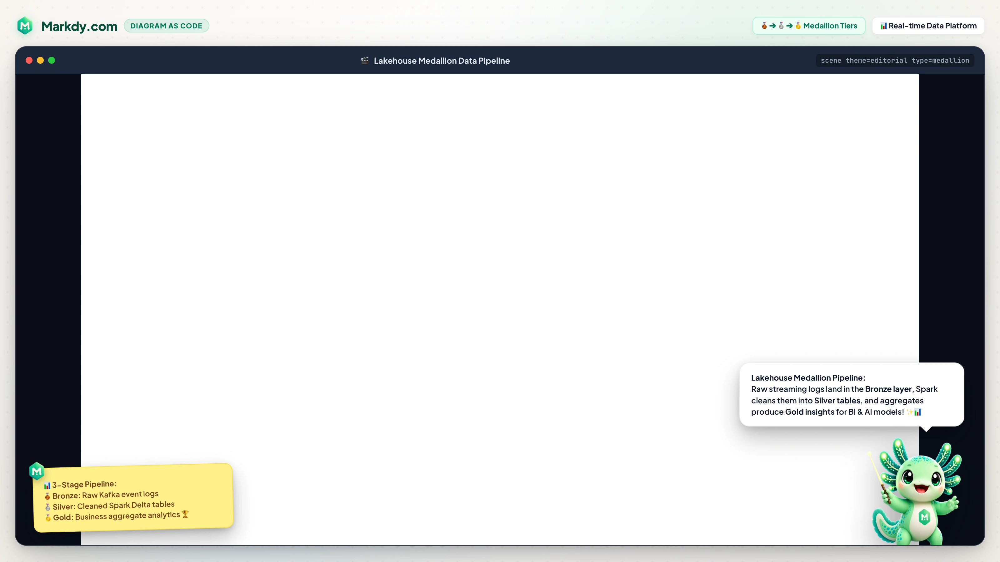
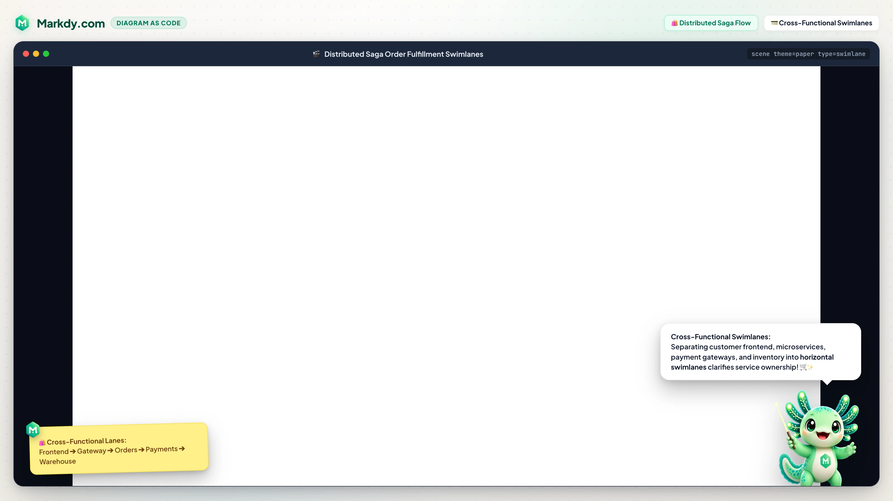
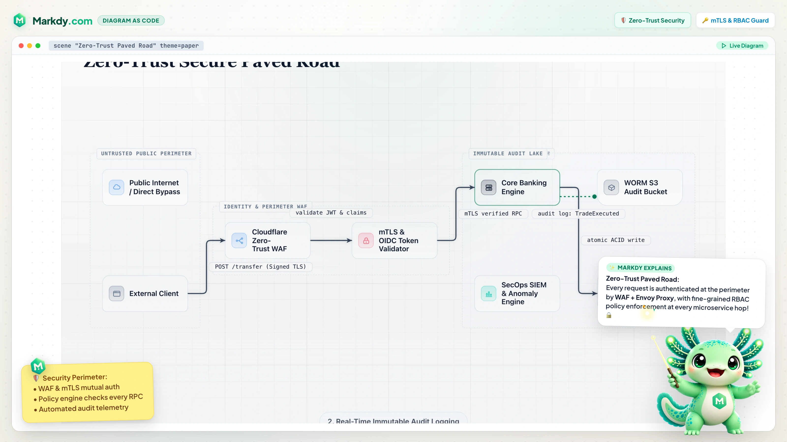
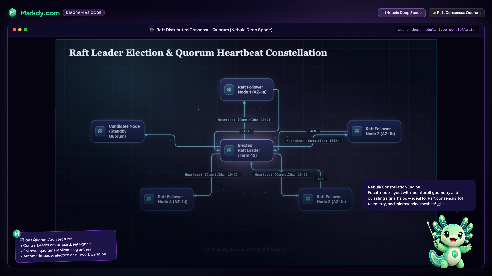
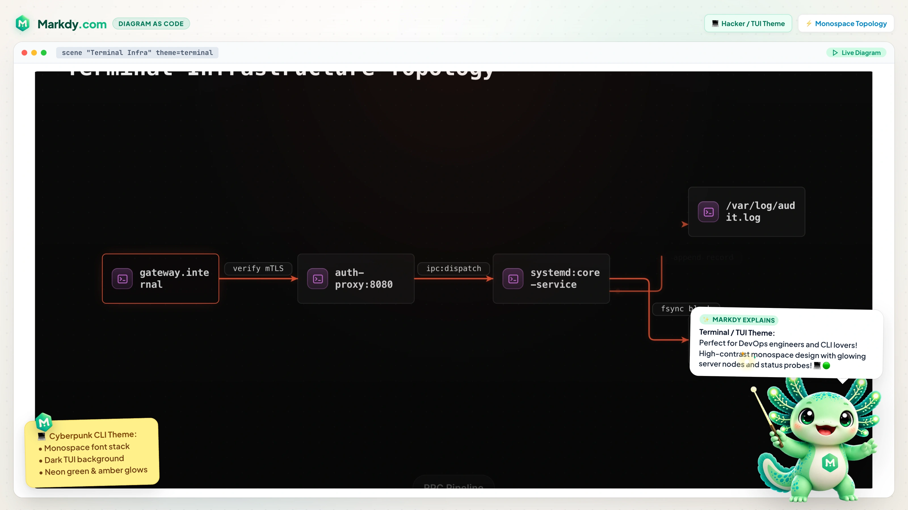

# MarkdyScript examples

Every file in this tree parses cleanly on the current 0.8 diagram grammar. Changes that break an example also break the `verify:examples` gate in CI.

## Layout

- Top-level `.markdy` files — a progressive learning sequence, one concept per file:
  - [`01-first-diagram.markdy`](01-first-diagram.markdy) — nodes, a beat, and a flow chain.
  - [`02-flow-operators.markdy`](02-flow-operators.markdy) — the four edge operators (`->`, `<-`, `~>`, `--`).
  - [`03-beats-and-groups.markdy`](03-beats-and-groups.markdy) — beats, groups, parallel `&` cues, `glow`/`focus`.
  - [`04-patterns-and-styles.markdy`](04-patterns-and-styles.markdy) — reusable `pattern` + `use`, and node `style`.
  - [`05-universal-ingestion.markdy`](05-universal-ingestion.markdy) — microservice mesh transpiled from Docker Compose & Kubernetes.
  - [`06-architecture-governance.markdy`](06-architecture-governance.markdy) — Well-Architected governance with layered isolation and cycle validation.
  - [`07-flywheel-loop.markdy`](07-flywheel-loop.markdy) — circular closed-loop engine with tangential flow paths.
  - [`08-medallion-lakehouse.markdy`](08-medallion-lakehouse.markdy) — multi-tier Bronze &rarr; Silver &rarr; Gold data lakehouse stages.
  - [`09-strategic-quadrant.markdy`](09-strategic-quadrant.markdy) — 2&times;2 strategic decision & technology positioning matrix.
  - [`10-cross-functional-swimlane.markdy`](10-cross-functional-swimlane.markdy) — cross-functional horizontal lane partitions.
  - [`11-enterprise-pyramid.markdy`](11-enterprise-pyramid.markdy) — value pyramids and step-proportional tier stacks.
  - [`12-multi-axis-radar.markdy`](12-multi-axis-radar.markdy) — multi-axis polygon technology benchmark radar chart.
  - [`13-secure-paved-road.markdy`](13-secure-paved-road.markdy) — Zero-trust secure paved road with perimeter and egress gateways.
  - [`14-fanin-queue-bottleneck.markdy`](14-fanin-queue-bottleneck.markdy) — Fan-in queue with worker concurrency and throughput bottlenecks.
  - [`15-project-timeline.markdy`](15-project-timeline.markdy) — horizontal milestone baseline with collision-free alternating placement.
  - [`16-gantt-roadmap.markdy`](16-gantt-roadmap.markdy) — Gantt task schedules with phase and span tracking.
  - [`17-venn-overlap.markdy`](17-venn-overlap.markdy) — 2&ndash;3 circle set overlap and sweet-spot intersection.
  - [`18-layer-stack.markdy`](18-layer-stack.markdy) — OSI & abstraction layer stacked horizontal bands.
  - [`19-nested-containment.markdy`](19-nested-containment.markdy) — concentric defense-in-depth security perimeters.
- `showcase/` — 30 curated showcase demo scenes shown on the homepage playground and docs page.
- `astro-starter/` — a minimal Astro project embedding the `<Markdy />` component.

## Visual Showcase Gallery

| Kubernetes Cloud Blueprint | Lakehouse Medallion Data Pipeline |
|---|---|
|  |  |

| Cross-Functional Swimlanes | Zero-Trust Secure Paved Road |
|---|---|
|  |  |

| Signal Constellation (Nebula) | Terminal Infrastructure CLI |
|---|---|
|  |  |

Compat-gate fixtures (baseline snapshot corpus) live alongside their snapshots in `packages/compat/fixtures/` and are covered by `pnpm run gate`.

## Verifying

```bash
pnpm run verify:examples   # parse every file, assert no regressions
pnpm run gate              # compat-gate against baseline snapshots
pnpm run ci                # full test + gate + verify pipeline
```

